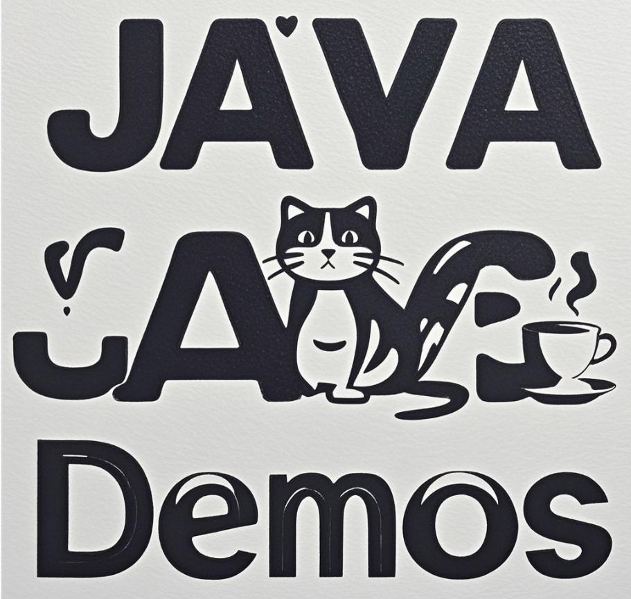

    

## 😀项目说明

本项目总结 Java 技术栈的应用案例，旨在帮助开发者快速理解核心概念与实践。

## 🐌学习示例

### **(1) java-demos**

本部分总结 Java 常用的案例，涵盖数据类型、异常处理、集合、线程等核心概念。

- [java-datatype](java-demos\java-datatype) : 分析 Java 的基本数据类型，并研究比较常用的 Java 类( 例如 StringBuffer 、StringBuilder )。
- [java-annotation](java-demos\java-annotation)：自定义注解，并且通过反射在运行时获取注解信息。
- [java-exception](java-demos\java-exception) ：研究自定义异常的使用方法，并给出自定义异常的案例。
- [java-collections](java-demos\java-collections) ：提供 Java 线程安全和线程不安全的集合使用案例。
- [java-lock](java-demos\java-lock) ：分析 Java 内置锁和 Java 显示锁如何解决自增线程不安全。
- [java-thread](java-demos\java-thread) ：探索线程状态查询、常用方式和线程池的使用，重点分析 ThreadLocal 和 CompletableFuture 的应用。
- [java-io](java-demos\java-io) ：总结 Java I/O 的使用案例。
- [java-sorting-algorithm](java-demos\java-sorting-algorithm) ：利用 Java 实现排序算法，例如堆排序、归并排序。

### **(2) spring-boot-demos**

本部分包含使用 Spring Boot 框架创建的各种示例项目，涵盖 AOP、RESTful 服务、文件操作等。

- [spring-boot-helloword](./spring-boot-demos/spring-boot-helloword)：创建 Hello World 项目，了解 Spring Boot 的基本构建流程。

- [spring-boot-aop](./spring-boot-demos/spring-boot-aop) :  AOP 的使用方法 ， 并且给出打印日志的案例。

- [spring-boot-restful-service](./spring-boot-demos/spring-boot-restful-service)：创建一个简单的 RESTful Web 服务项目，熟悉 RESTful 构建流程。

- [spring-boot-starter](./spring-boot-demos/spring-boot-starter) ：自定义 Starter， 并测试 Starter 的运行情况。

- [spring-boot-convention](spring-boot-demos\spring-boot-convention) ：抽象异常码、异常、前后端响应实体，并利用 `@RestControllerAdvice` 和 `@ExceptionHandler` 来实现全局异常处理。

- [spring-boot-file](./spring-boot-demos/spring-boot-file) ：利用 Spring MVC 实现文件分片下载和上传。

- [spring-boot-idempotent](./spring-boot-demos/spring-boot-idempotent) ：利用分布式锁实现接口防重复提交，并利用 Redis 去重表实现消息队列防重复消费。

  

### **(3) spring-cloud-demos**

本部分展示了使用 Spring Cloud 构建微服务架构的示例项目，包括服务注册、发现和流量控制等功能。

- [spring-cloud-openfeign](./spring-cloud-demos/spring-cloud-openfeign) ： 研究 OpenFeign 的使用方法，简化 HTTP 客户端调用。
- [spring-cloud-nacos](./spring-cloud-demos/spring-cloud-nacos) ：研究 Nacos 的服务注册与发现及自动配置。
- [spring-cloud-sentinel](./spring-cloud-demos/spring-cloud-sentinel) ：给出不同规则的实现案例。

### **(4) middleware-demos**

本部分包含对常用中间件的示例项目，包括 Redis、MyBatis 和 RocketMQ 的使用。

- [spirng-boot-redis](./middleware-demos/spirng-boot-redis) ：利用 RedisTemplate 操作 Redis里面的数据，展示基本的 CRUD 操作。

- [spring-boot-mybatis](./middleware-demos/spring-boot-mybatis) ：使用 `mybatis` 依赖来查询数据库，深入研究 MyBatis 框架的应用。

- [spring-boot-mybatis-starter](./middleware-demos/spring-boot-mybatis-starter) : 使用 `mybatis-spring-boot-starter` 依赖进行数据库查询。

- [spring-boot-rocketmq](./middleware-demos/spring-boot-rocketmq) :  使用 `rocketmq-client-java` 依赖，生产和消费不同类型的消息。

- [spring-boot-rocketmq-starter](./middleware-demos/spring-boot-rocketmq-starter) :  研究 `rocketmq-spring-boot-starter` 的使用方法，简化消息处理。

- [spring-boot-minio](./middleware-demos/spring-boot-minio)： 展示 MinIO 中间件的使用案例，并使用 Spring AOP 进行配置。

- [spring-boot-canal](middleware-demos\spring-boot-canal) ：给出 Canal 的使用案例。

- [spring-boot-canal-redis](middleware-demos\spring-boot-canal-redis) ：使用 Canal 和 RocketMQ 实现 MySQL 增量数据的异步缓存更新。

  

### **(5) design-pattern-demos**

本部分分析常见的设计模式，帮助理解如何在项目中应用这些模式以提高代码质量和可维护性。

- [singeleton-pattern](./design-pattern-demos/singeleton-pattern) ：分析懒汉式单例模式和饿汉式单例模式的使用及其优缺点。

- [builder-pattern](design-pattern-demos/builder-pattern) ：研究建造者模式及 @Builder 注解的使用，简化复杂对象的创建。

- [proxy-pattern](design-pattern-demos\proxy-pattern) ：利用 Java 反射实现代理模式。

- [strategy-pattern](design-pattern-demos\strategy-pattern) ：实现策略模式，并利用 IoC 容器自动添加策略类。

## 🥀结语

感谢您访问本项目！希望这些示例能够为您的学习与开发提供帮助。如果您觉得这些内容对您有价值，欢迎给项目点赞⭐️，您的支持是我不断更新和完善的动力！