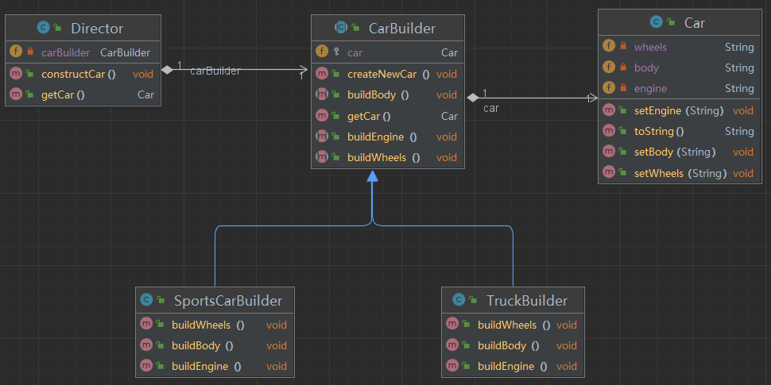

## 一、建造者模式

### 建造者模式的定义

建造者模式（Builder Pattern）也叫做生成器模式，其定义如下：

 <font color="blue">**Separate the construction of a complex object from its representation so that the same construction process can create different representations**</font>.（将一个复杂对象的构建与它的表示分离，使得同样的构建过程可以创建不同的表示。）

构建和表示的含义如下：

**构建: 创建对象的过程**，涉及按照一定的步骤、顺序来组合对象的各个部分，最终生成一个完整的对象。例如，构造一辆汽车包括安装发动机、安装轮胎、装配车身等步骤。论汽车的类型如何，这些基本步骤都是相同的。

**表示：构建对象的具体形态或形式**。不同的表示意味着通过同样的构建步骤，可以生成不同的对象形式。例如，汽车可以有不同的表示，比如一辆跑车和一辆卡车。尽管构建的过程都包括安装发动机、轮胎和车身等步骤，但不同的表示会在每个步骤中有所不同，比如跑车使用的是高性能发动机，而卡车可能使用的是大功率发动机。

同样的构建步骤所生成的对象的具体形式，可能会因构造器的不同而有所变化。


### 建造者模式的参与者

在建造者模式中，不同参与者的作用如下：

-  **Product（产品）**： 复杂对象的类，表示需要创建的复杂对象， 通常包含多个部件（字段）。它是建造者模式的最终生成目标。
-  **Builder（抽象建造者）**：定义了构建 `Product` 各部分的抽象接口。该接口规定了用于创建产品各个部件的方法，但并不实现这些方法。还包含一个返回最终产品对象的方法。
- **ConcreteBuilder（具体建造者）**：具体化了创建产品各个部件的方法，负责跟踪构建过程的状态，并最终生成产品。<font color="red">**每个具体建造者可以创建产品的不同表示**</font>。
- **Director（指挥者）**：指挥者类负责控制构建过程的顺序，指导 `Builder` 来创建产品。换句话说，它<font color="red">**定义了构建产品的步骤顺序**</font>，确保每个步骤按特定的顺序执行。

注意，Director 和 Builder 是聚合关系， 共同协作来完成对象的创建。


### 建造者模式的优点

- 封装性。不关注每一个具体的模型内部如何实现。
- 便于控制细节风险。由于具体的建造者是独立的，因此可以对建造过程逐步细化，而不对其他的模块产生任何影响。


### 建造者模式的使用场景

- 相同的方法，不同的执行顺序，产生不同的事件结果时，可以采用建造者模式。
- **如果类的属性之间有一定的依赖关系或者约束条件（源自设计模式之美）**，那么就可以考虑使用 Builder 设计模式。
- 产品类非常复杂，这个时候使用建造者模式非常合适。


## 二、普通案例

### 代码设计

具体工作流程为：

- **构建**：我们定义一个构造器（`Builder`）类，用来逐步创建复杂对象。这个类包含生成对象的多个步骤（如“安装发动机”、“安装轮胎”）。

- **表示**：我们定义不同的具体构造器（`ConcreteBuilder`）类，每个构造器生成一个特定的表示（如“跑车”或“卡车”）。


### 实现代码





## 三、Lombok 实现案例

Lombok 库中的**注解 `@Builder` 可以自动创建一个实现建造者模式的类**。当在类上添加@Builder注解后，Lombok会自动生成一个建造者类，可以在类的外部使用建造者模式来创建该类的实例。

实际上，仅使用建造者模式创建复杂对象时，我们有时候可能并不需要创建 Director 类， 而是**在创建对象的时候手动指定产品创建步骤**。

### @Builder 使用方法

创建一个类，使用相应注解

```java
@Data
@Builder
public class User {
    // 用户 ID
    private String userId;

    // 用户名
    private String username;

}

public class BuilderPatternExample {
    public static void main(String[] args) {
        User user = User.builder()
                .userId("123456")
                .username("zhangsan")
                .build();
        System.out.println(user); // 返回结果为 User(userId=123456, username=zhangsan)
    }
}

```


### @Builder 实际所作工作

查看编译后的 User 类的源码， 可以发现在内部创建了具体建造者 `UserBuilder`

```java
public class User {
    private String userId;
    private String username;

    @Generated
    public static UserBuilder builder() {
        return new UserBuilder();
    }
    
    // setter，getter，equal，construct，hashCode， toString等方法
    ...
    
     @Generated
    public static class UserBuilder {
        @Generated
        private String userId;
        @Generated
        private String username;

        @Generated
        UserBuilder() {
        }

        @Generated
        public UserBuilder userId(final String userId) {
            this.userId = userId;
            return this;
        }

        @Generated
        public UserBuilder username(final String username) {
            this.username = username;
            return this;
        }

        @Generated
        public User build() {
            return new User(this.userId, this.username);
        } 
    }
}
```


## 参考资料

《设计模式之禅 (第2版)》

 [秒懂设计模式之建造者模式（Builder pattern） - 知乎 (zhihu.com)](https://zhuanlan.zhihu.com/p/58093669)

[Hutool如何使用Builder模式创建线程池 (yuque.com)](https://www.yuque.com/magestack/12306/qztuml34mqglvdq8)