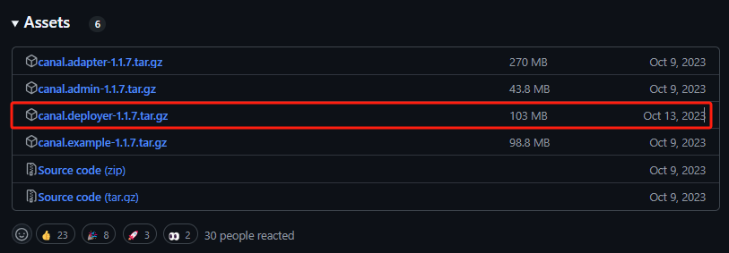
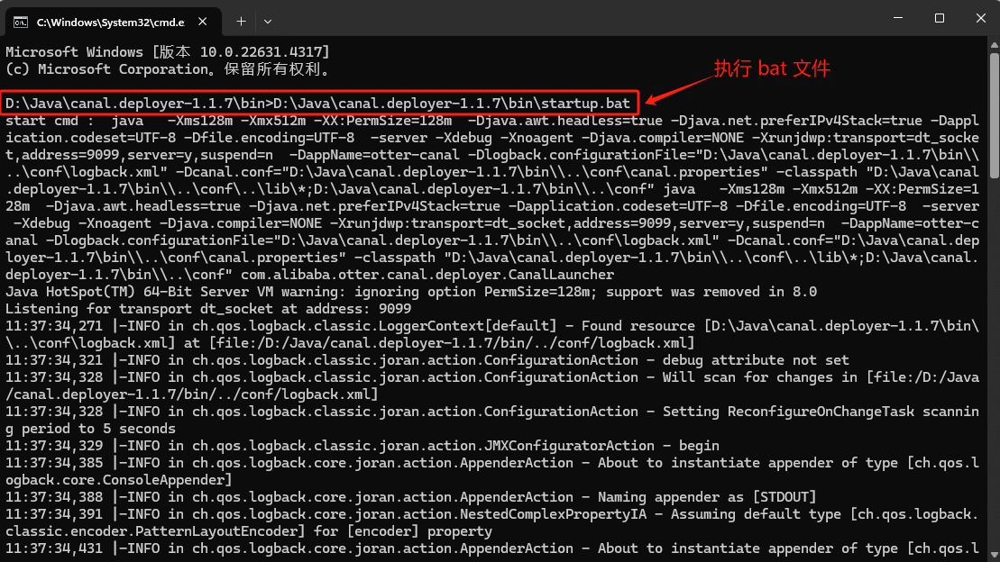

### 一、Docker 容器启动(存在问题)

### 1.1 启动容器

```bash
$ docker pull canal/canal-server:v1.1.7

$ docker run -d ^
  --name canal-server ^
  --restart always ^
  -p 11111:11111 ^
  --privileged=true ^
  -e canal.destinations=test ^
  -e canal.serverMode=rocketMQ ^
  -e rocketmq.producer.group=my-producer_canal-test-topic ^
  -e rocketmq.namesrv.addr=host.docker.internal:9876 ^
  -e canal.instance.master.address=host.docker.internal:3306 ^
  -e canal.instance.filter.regex=test_db.users,.*\\..* ^
  -e canal.mq.topic=canal-test-topic ^
  -m 4096m ^
  canal/canal-server:v1.1.7
```


### 1.2 查看日志

在 canal 启动成功后，查看启动日志

```bash
$ docker logs canal-server
2024-10-28 21:29:00 DOCKER_DEPLOY_TYPE=VM
2024-10-28 21:29:00 ==> INIT /alidata/init/02init-sshd.sh
2024-10-28 21:29:00 ==> EXIT CODE: 0
2024-10-28 21:29:00 ==> INIT /alidata/init/fix-hosts.py
2024-10-28 21:29:00 ==> EXIT CODE: 0
2024-10-28 21:29:00 ==> INIT DEFAULT
2024-10-28 21:29:00 ==> INIT DONE
2024-10-28 21:29:00 ==> RUN /home/admin/app.sh
2024-10-28 21:29:01 ==> START ...
2024-10-28 21:29:01 start canal ...
2024-10-28 21:29:00 Failed to get D-Bus connection: Operation not permitted
2024-10-28 21:29:00 Failed to get D-Bus connection: Operation not permitted
2024-10-28 21:29:36 start canal successful
2024-10-28 21:29:36 ==> START SUCCESSFUL ...
```

看到 successful 之后，就代表 canal-server 启动成功，然后就可以在 canal-admin 上进行任务分配了。


**a.查看 logs/canal/canal.log**

```
docker exec -it canal-server /bin/bash -c "tail -f /home/admin/canal-server/logs/canal/canal.log"
```

**b.查看 /logs/canal/rocketmq_client.log**

```
$ docker exec -it canal-server /bin/bash -c "tail -f /home/admin/canal-server/logs/canal/rocketmq_client.log"
```

**c. 查看instance的日志**

```
docker exec -it canal-server /bin/bash -c "tail -f /home/admin/canal-server/logs/test/test.log"
```


### 二、Windows 本地启动

在 [canal 官网](https://github.com/alibaba/canal/releases)，下载 canal.deployer-1.1.7.tar.gz 并解压缩到指定目录。



### 2.1 修改配置文件

修改配置文件 `/conf/canal.properties`

```properties
#################################################
######### 		common argument		#############
#################################################
# tcp, kafka, rocketMQ, rabbitMQ, pulsarMQ
canal.serverMode = rocketMQ

#################################################
######### 		destinations		#############
#################################################
canal.destinations = example

##################################################
######### 	      MQ Properties      #############
##################################################
canal.mq.flatMessage = true
canal.auto.scan = false

##################################################
######### 		    RocketMQ	     #############
##################################################
rocketmq.producer.group = my-producer_canal-test-topic
rocketmq.enable.message.trace = false
rocketmq.customized.trace.topic =
rocketmq.namespace =
rocketmq.namesrv.addr = 127.0.0.1:9876
rocketmq.retry.times.when.send.failed = 0
rocketmq.vip.channel.enabled = false
rocketmq.tag =
```

修改 `/conf//example/instance.properties` 配置文件

```properties
canal.instance.master.address=127.0.0.1:3306

canal.instance.dbUsername=canal
canal.instance.dbPassword=canal

# table regex
canal.instance.filter.regex=.*\\..*

# mq config
canal.mq.topic=canal-test-topic
```


### 2.2 启动 canal

在 canal 的安装目录下，执行 `/canal.deployer-1.1.7/bin/startup.bat`  文件。



