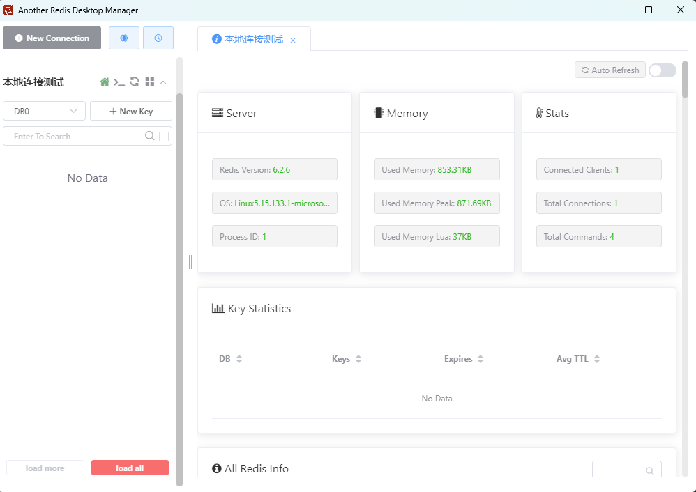
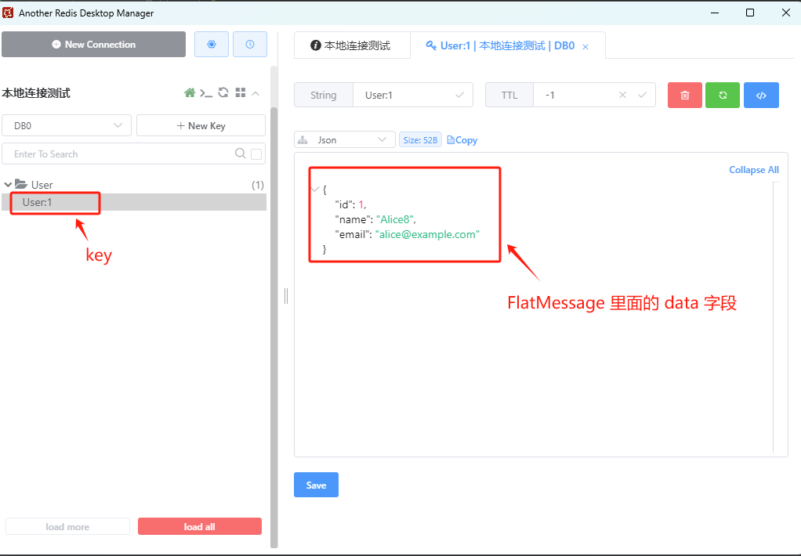

[TOC]

##  一、安装 MySQL 

[QuickStart · alibaba/canal Wiki (github.com)](https://github.com/alibaba/canal/wiki/QuickStart)


### 1.1 启动 mysql 服务器

```bash
docker run --name mysql-canal ^
-p 3306:3306 ^
-e MYSQL_ROOT_PASSWORD=root ^
-d mysql:5.7.36
```


### 1.2 开启 Binlog 写入功能

对于自建 MySQL容器 , 我们需要开启 Binlog 写入功能。


#### 1.2.1创建 binlog 配置文件

在宿主机上创建 `my.cnf` 文件，配置 binlog-format 为 ROW 模式。`my.cnf` 的配置内容如下：

```ini
[mysqld]
# 开启 binlog
log-bin=mysql-bin 
# 选择 ROW 模式
binlog-format=ROW 
# 配置 MySQL replaction 需要定义，不要和 canal 的 slaveId 重复
server_id=1 
```


#### 1.2.2 修改配置文件权限

进入 MySQL 容器并修改 MySQL 容器配置文件  `/etc/mysql/my.cnf`  权限，以避免权限警告：

```bash
# 进入 MySQL 容器
$ docker exec -it mysql-canal bash

# 修改文件权限
$ chmod 644 /etc/mysql/my.cnf
$ exit
```

注意，在没有修改配置文件并启动 MySQL 容器情况下，MySQL 会警告配置文件 `/etc/mysql/my.cnf` [权限设置不当](https://stackoverflow.com/questions/53741107/mysql-in-docker-on-ubuntu-warning-world-writable-config-file-is-ignored)，允许所有用户写入（world-writable）。<font color="red">**由于安全原因，MySQL 会忽略这个配置文件**</font>。

```
[Warning] World-writable config file '/etc/mysql/my.cnf' is ignored.
```


#### 1.2.3 挂载配置文件

在 MySQL 容器运行后，使用以下命令将创建的 `my.cnf` 文件覆盖容器内的 `/etc/mysql/my.cnf`：

```bash
# 覆盖配置文件
$ docker cp D:\Learning\java-demos\middleware-demos\spring-boot-canal\src\main\resources\conf\my.cnf mysql-canal:/etc/mysql/

# 为了使新的配置生效，重启 MySQL 容器
$ docker restart mysql-canal
```

注意，MySQL 容器的 `/etc/mysql/my.cnf` 是一个符号链接，直接指定完整路径时会导致问题。

>  MySQL 启动时会首先加载主配置文件 `/etc/mysql/my.cnf`，然后加载 `conf.d` 目录下的所有配置文件。


#### 1.2.4 检测 binlog 配置是否成功

进入 MySQL， 利用  `show variables like 'log_bin';`  查看是否打开 binlog 模式：

```bash
$ docker exec -it mysql-canal bash

# 查看挂载后的 my.cnf 文件
$ tail /etc/mysql/my.cnf

# 查看 binlog 是否开启
$ mysql -uroot -proot
mysql> show variables like 'log_bin';
+---------------+-------+
| Variable_name | Value |
+---------------+-------+
| log_bin       | ON    |
+---------------+-------+
1 row in set (0.01 sec)

# 查看 binlog 日志文件列表
mysql> show binary logs;

# 查看正在写入的 binlog 文件
mysql> show master status;

# 查看 Binlog 文件内容
mysql> mysqlbinlog /var/lib/mysql/mysql-bin.000001


```


### 1.3 创建账户并授权

授权 canal 链接 MySQL 账号具有作为 MySQL slave 的权限, 如果已有账户可直接 grant

```bash
# 进入 mysql 容器
$ docker exec -it mysql-canal mysql -uroot -proot

# 创建用户名和密码都为 canal 的账户
mysql> CREATE USER canal IDENTIFIED BY 'canal';

# 授予权限 GRANT ALL PRIVILEGES ON *.* TO 'canal'@'%' ;
mysql> GRANT SELECT, REPLICATION SLAVE, REPLICATION CLIENT ON *.* TO 'canal'@'%';
FLUSH PRIVILEGES;
```


## 二、安装 RocketMQ 

### 2.1 创建容器共享网络

RocketMQ 中有多个服务，需要创建多个容器，创建 docker 网络便于容器间相互通信。

```bash
$ docker network create rocketmq
```


### 2.2 启动 NameServer 

在 Docker 容器中运行 RocketMQ 的 NameServer 服务：

```shell
# 拉取RocketMQ镜像
$ docker pull apache/rocketmq:5.3.0

# 启动 NameServer
$ docker run -d ^
-p 9876:9876  ^
--name rmqnamesrv-canal ^
--network rocketmq ^
apache/rocketmq:5.3.0 sh mqnamesrv

# 验证 NameServer 是否启动成功
$ docker logs -f rmqnamesrv
```


### 2.3 启动 Broker

Brocker 部署相对麻烦一点，主要是在系统里面创建一个配置文件。然后，通过 docker 的 -v 参数使用 volume 功能，将本地配置文件映射到容器内的配置文件上。否则所有数据都默认保存在容器运行时的内存中，重启之后就又回到最初的起点。

**(1) 新建配置文件 broker.conf**

创建配置文件 broker.conf， 放到指定的目录 `D:\Learning\java-demos\middleware-demos\spring-boot-canal-redis\src\main\resources\rocketmq\conf` 下

```
brokerClusterName = DefaultCluster
brokerName = broker-a
brokerId = 0
deleteWhen = 04
fileReservedTime = 48
brokerRole = ASYNC_MASTER
flushDiskType = ASYNC_FLUSH
brokerIP1 = 10.8.12.174 # 此处为本地ip, 如果部署服务器, 需要填写服务器外网ip
```

注意，如果其他容器和本地客户端都要与该容器通信，不要使用 localhost 和 host.docker.internal ，可以使用 ipconfig 查看当前宿主机的 IP 地址。


**(2) 启动容器**

```sh
# 启动 Broker 和 Proxy
$ docker run -d ^
--name rmqbroker-canal ^
--network rocketmq ^
-p 10912:10912 -p 10911:10911 -p 10909:10909 ^
-p 8080:8080 -p 8081:8081 ^
-e "NAMESRV_ADDR=rmqnamesrv-canal:9876" ^
-e "JAVA_OPTS=-Duser.home=/opt" ^
-e "JAVA_OPT_EXT=-server -Xms512m -Xmx512m" ^
-v D:\Learning\java-demos\middleware-demos\spring-boot-canal-redis\src\main\resources\rocketmq\conf\broker.conf:/home/rocketmq/rocketmq-5.3.0/conf/broker.conf ^
apache/rocketmq:5.3.0 sh mqbroker --enable-proxy ^
-c /home/rocketmq/rocketmq-5.3.0/conf/broker.conf

# 验证 Broker 是否启动成功
$ docker exec -it rmqbroker-canal bash -c "tail -n 10 /home/rocketmq/logs/rocketmqlogs/proxy.log"
```

**(3)创建 Topic**

进入 broker 容器，通过 mqadmin 创建 Topic。

```bash
# 进入名为rmqbroker的容器，并启动一个交互式的Bash shell
$ docker exec -it rmqbroker-canal bash 

# 在容器内部使用 mqadmin 工具创建名为 TestTopic 的主题配置
$ sh mqadmin updatetopic -t canal-test-topic -c DefaultCluster
```


### 2.4 启动 rocketmq-console

启动容器

```bash
docker run -d ^
--name rmqconsole-test ^
--network rocketmq ^
--link rmqnamesrv-canal:namesrv ^
-e "JAVA_OPTS=-Drocketmq.config.namesrvAddr=namesrv:9876 -Drocketmq.config.isVIPChannel=false" ^
-p 8088:8080 ^
-t pangliang/rocketmq-console-ng
```

运行成功，稍等几秒启动时间，浏览器输入 http://localhost:8088 查看。


## 三、安装 canal

### 3.1 启动容器

```bash
# 拉取 Canal Server 的 Docker 镜像
$ docker pull canal/canal-server:v1.1.7

# 启动 Canal Server 容器
$ docker run -d ^
  --name canal-server ^
  --restart always ^
  -p 11111:11111 ^
  --privileged=true ^
  -e canal.destinations=test ^
  -e canal.serverMode=rocketMQ ^
  -e rocketmq.producer.group=my-producer_canal-test-topic ^
  -e rocketmq.namesrv.addr=host.docker.internal:9876 ^
  -e canal.instance.master.address=host.docker.internal:3306 ^
  -e canal.instance.filter.regex=test_db.users,.*\\..* ^
  -e canal.mq.topic=canal-test-topic ^
  -m 4096m ^
  canal/canal-server:v1.1.7
```


### 3.2 查看日志

在 canal 启动成功后，查看启动日志：

```bash
$ docker logs canal-server
2024-10-28 21:29:00 DOCKER_DEPLOY_TYPE=VM
2024-10-28 21:29:00 ==> INIT /alidata/init/02init-sshd.sh
2024-10-28 21:29:00 ==> EXIT CODE: 0
2024-10-28 21:29:00 ==> INIT /alidata/init/fix-hosts.py
2024-10-28 21:29:00 ==> EXIT CODE: 0
2024-10-28 21:29:00 ==> INIT DEFAULT
2024-10-28 21:29:00 ==> INIT DONE
2024-10-28 21:29:00 ==> RUN /home/admin/app.sh
2024-10-28 21:29:01 ==> START ...
2024-10-28 21:29:01 start canal ...
2024-10-28 21:29:00 Failed to get D-Bus connection: Operation not permitted
2024-10-28 21:29:00 Failed to get D-Bus connection: Operation not permitted
2024-10-28 21:29:36 start canal successful
2024-10-28 21:29:36 ==> START SUCCESSFUL ...
```

看到 successful 之后，就代表 canal-server 启动成功，然后就可以在 canal-admin 上进行任务分配了。


## 四、安装 Redis

### 4.1 启动 Redis

```
docker run ^
--restart=always ^
-p 6379:6379 ^
--name redis-canal ^
-d redis:latest  --requirepass 123456
```


### 4.2 使用 Another Redis Desktop Manager 客户端

在 github 上面下载 nother Redis Desktop Manager 客户端，并连接到 redis-canal。




## 五、实现客户端代码

### 5.1 导入依赖

创建 Spring Boot 项目，并导入以下依赖。

```xml
<dependency>
    <groupId>com.alibaba.otter</groupId>
    <artifactId>canal.client</artifactId>
    <version>1.1.7</version>
</dependency>

<!-- Message、CanalEntry.Entry等来自此安装包 -->
<dependency>
    <groupId>com.alibaba.otter</groupId>
    <artifactId>canal.protocol</artifactId>
    <version>1.1.7</version>
</dependency>

<dependency>
    <groupId>org.rocketmq.spring.boot</groupId>
    <artifactId>rocketmq-spring-boot-starter</artifactId>
    <version>2.3.0</version>
</dependency>

<dependency>
    <groupId>org.springframework.boot</groupId>
    <artifactId>spring-boot-starter-data-redis</artifactId>
</dependency>
```


### 5.2 配置 application.yaml

`application.yaml` 的内容如下：

```yaml
spring:
  application:
    name: spring-boot-canal-redis
  datasource:
    url: jdbc:mysql://localhost:3306/test_db?useSSL=false&serverTimezone=UTC
    username: root
    password: root
    driver-class-name: com.mysql.cj.jdbc.Driver
  data:
    redis:
      host: localhost
      port: 6379
      database: 0
      password: "123456"
      lettuce:
        pool:
          max-active: 8
          max-idle: 8
          min-idle: 0
          max-wait: -1ms

rocketmq:
  name-server: localhost:9876
  producer:
    group: my-producer_canal-test-topic
    send-message-timeout: 60000
    retry-times-when-send-failed: 2
    retry-times-when-send-async-failed: 2
#  consumer:
#    group: my-consumer_canal-test-topic

server:
  port: 8089
```


### 5.3 实现Canal同步服务代码

#### 5.3.1 Canal同步服务接口

```java
/**
 *  Canal同步服务接口，用于处理来自Canal的数据同步请求
 *  该接口主要定义了如何处理数据变更事件，包括DDL语句执行和DML操作（插入、更新、删除）
 *
 * @author zouhu
 * @data 2024-10-31 15:16
 */
public interface CanalSyncService<T> {
    /**
     * 处理数据变更事件
     * <p>
     *     该方法用于处理来自Canal的数据变更事件，包括DDL语句执行和其他数据操作（如插入、更新和删除）
     * </p>
     *
     * @param flatMessage CanalMQ数据
     */
    void process(FlatMessage flatMessage);

    /**
     * DDL语句处理
     *
     * @param flatMessage CanalMQ数据
     */
    void ddl(FlatMessage flatMessage);

    /**
     * 插入
     *
     * @param list 新增数据
     */
    void insert(Collection<T> list);

    /**
     * 更新
     *
     * @param list 更新数据
     */
    void update(Collection<T> list);

    /**
     * 删除
     *
     * @param list 删除数据
     */
    void delete(Collection<T> list);
}

```


#### 5.3.2 抽象Canal-RocketMQ通用处理服务

```java
/**
 * 抽象Canal-RocketMQ通用处理服务
 *
 *
 * @author zouhu
 * @data 2024-10-31 15:21
 */
@Slf4j
@RequiredArgsConstructor
public abstract class AbstractCanalRocketMqRedisService<T> implements CanalSyncService<T> {

    private final RedisTemplate<String, Object> redisTemplate;

    private Class<T> classCache;


    /**
     * 获取Model名称
     *
     * @return Model名称
     */
    protected abstract String getModelName();

    /**
     * 处理数据
     * <p>
     *     后续优化：可以使用策略模式来封装不同表的操作，不一定要统一
     * </p>
     *
     * @param flatMessage CanalMQ数据
     */
    @Override
    public void process(FlatMessage flatMessage) {

        if (flatMessage.getIsDdl()) {
            ddl(flatMessage);
            return;
        }

        Set<T> data = getData(flatMessage);

        if (SqlType.INSERT.getType().equals(flatMessage.getType())) {
            insert(data);
        }

        if (SqlType.UPDATE.getType().equals(flatMessage.getType())) {
            update(data);
        }

        if (SqlType.DELETE.getType().equals(flatMessage.getType())) {
            delete(data);
        }

    }

    /**
     * DDL语句处理
     *
     * @param flatMessage CanalMQ数据
     */
    @Override
    public void ddl(FlatMessage flatMessage) {
        //TODO : DDL需要同步，删库清空，更新字段处理
    }

    /**
     * 插入
     *
     * @param list 新增数据
     */
    @Override
    public void insert(Collection<T> list) {
        insertOrUpdate(list);
    }

    /**
     * 更新
     *
     * @param list 更新数据
     */
    @Override
    public void update(Collection<T> list) {
        insertOrUpdate(list);
    }

    /**
     * 删除
     *
     * @param list 删除数据
     */
    @Override
    public void delete(Collection<T> list) {
        Set<String> keys = Sets.newHashSetWithExpectedSize(list.size());

        for (T data : list) {
            keys.add(getWrapRedisKey(data));
        }

        redisTemplate.delete(keys);
    }

    /**
     * 插入或者更新redis
     * <p>
     *     data 对象里面还包含 getTypeArgument()的返回值，但是没有写到 Redis 里面
     * </p>
     *
     * @param list 数据
     */
    private void insertOrUpdate(Collection<T> list) {
        for (T data : list) {
            log.info("redis data:{}", data);
            String key = getWrapRedisKey(data);
            log.info("redis key:{}", key);
            redisTemplate.opsForValue().set(key, data);
        }
    }

    /**
     * 封装redis的key
     *
     * @param t 原对象
     * @return key
     */
    protected String getWrapRedisKey(T t) {
        return getModelName() + ":" + getIdValue(t);
    }

    /**
     * 获取类泛型
     *
     * @return 泛型Class
     */
    @SuppressWarnings("unchecked")
    protected Class<T> getTypeArgument() {
        if (classCache == null) {
            classCache = (Class) ((ParameterizedType) this.getClass().getGenericSuperclass()).getActualTypeArguments()[0];
        }
        return classCache;
    }

    /**
     * 获取 Object 标有 @TableId 注解的字段值
     *
     * @param t 对象
     * @return id值
     */
    protected Object getIdValue(T t) {
        Field fieldOfId = getIdField();
        ReflectionUtils.makeAccessible(fieldOfId);
        return ReflectionUtils.getField(fieldOfId, t);
    }

    /**
     * 获取Class标有@TableId注解的字段名称
     *
     * @return id字段名称
     */
    protected Field getIdField() {
        Class<T> clz = getTypeArgument();
        Field[] fields = clz.getDeclaredFields();
        for (Field field : fields) {
            TableId annotation = field.getAnnotation(TableId.class);

            if (annotation != null) {
                return field;
            }
        }
        log.error("PO类未设置@TableId注解");
        throw new RuntimeException("PO类未设置@TableId注解");
    }

    /**
     * 转换 Canal 的 FlatMessage中的data成泛型对象
     *
     * @param flatMessage Canal发送MQ信息
     * @return 泛型对象集合
     */
    protected Set<T> getData(FlatMessage flatMessage) {
        List<Map<String, String>> sourceData = flatMessage.getData();
        Set<T> targetData = Sets.newHashSetWithExpectedSize(sourceData.size());
        for (Map<String, String> map : sourceData) {
            // 将Type类型的数据和T对象合并转换为泛型对象T
            T t = JSON.parseObject(JSON.toJSONString(map), getTypeArgument());
            targetData.add(t);
        }
        return targetData;
    }

}
```


#### 5.3.3 具体类的同步服务实现

```java
/**
 * User类的 Canal-RocketMQ通用处理服务实现
 *
 * @author zouhu
 * @data 2024-10-31 17:23
 */
@Component
public class UserCanalRocketMqRedisService extends AbstractCanalRocketMqRedisService<User> {
    public UserCanalRocketMqRedisService(RedisTemplate<String, Object> redisTemplate) {
        super(redisTemplate);
    }

    @Override
    protected String getModelName() {
        return "User";
    }
}
```


### 5.4 实体类

后续将根据这个实体类来进行测试。

```java
/**
 * User 实体类
 *
 * @author zouhu
 * @data 2024-10-31 13:29
 */
@Data
@EqualsAndHashCode(callSuper = false)
@Accessors(chain = true)
public class User extends Model<User> {

    private static final long serialVersionUID = 1L;

    @TableId(value = "id", type = IdType.AUTO)
    private Integer id;

    private String name;

    private String email;
}

```


### 5.5 RocketMQ 消费者

```java
/**
 * 监听所有表的数据修改 binlog
 * <p>
 *     目前只实现了单个表的处理逻辑, 后续可以使用策略模式实现不同表的处理逻辑
 * </p>
 *
 * @author zouhu
 * @data 2024-10-27 23:18
 */
@Slf4j
@Component
@RequiredArgsConstructor
@RocketMQMessageListener(
        topic = "canal-test-topic",
        consumerGroup = "my-consumer_test-topic-1"
)
public class CanalCommonSyncBinlogConsumer implements RocketMQListener<FlatMessage> {

    private final UserCanalRocketMqRedisService userCanalRocketMqRedisService;

    @Override
    public void onMessage(FlatMessage flatMessage) {
        log.info("consumer message {}", flatMessage);
        try {
            userCanalRocketMqRedisService.process(flatMessage);
        } catch (Exception e) {
            log.warn(String.format("message [%s] 消费失败", flatMessage), e);
            throw new RuntimeException(e);
        }
    }
}

```


### 5.6 后续优化方案

使用策略模式实现不同表的处理策略.


## 六、测试客户端代码

### 5.1 创建数据库及表

执行以下 sql 语句，创建数据库及表

```sql
CREATE DATABASE test_db;
USE test_db;

CREATE TABLE users (
    id INT PRIMARY KEY AUTO_INCREMENT,
    name VARCHAR(100),
    email VARCHAR(100)
);
```

查看 `/home/canal-server//logs/test/meta.log` 日志文件，数据库的每次增删改操作，都会在meta.log中生成一条记录，查看该日志可以确认 Canal 是否有采集到数据。

查看客户端控制台输出的信息

```bash
2024-10-31T22:56:24.607+08:00  INFO 13228 --- [spring-boot-canal-redis] [_test-topic-1_6] .z.s.c.r.m.CanalCommonSyncBinlogConsumer : consumer message FlatMessage [id=22, database=test_db, table=, isDdl=true, type=QUERY, es=1730386584000, ts=1730386584600, sql=CREATE DATABASE test_db, sqlType=null, mysqlType=null, data=null, old=null, gtid=]
2024-10-31T22:56:24.608+08:00  INFO 13228 --- [spring-boot-canal-redis] [_test-topic-1_7] .z.s.c.r.m.CanalCommonSyncBinlogConsumer : consumer message FlatMessage [id=22, database=test_db, table=users, isDdl=true, type=CREATE, es=1730386584000, ts=1730386584600, sql=CREATE TABLE users (
    id INT PRIMARY KEY AUTO_INCREMENT,
    name VARCHAR(100),
    email VARCHAR(100)
), sqlType=null, mysqlType=null, data=null, old=null, gtid=]
```


### 5.2  插入数据

执行以下 sql 语句

```sql
INSERT INTO users (name, email) VALUES ('Alice8', 'alice@example.com');
```

查看客户端控制台输出的信息

```bash
2024-10-31T22:57:12.601+08:00  INFO 13228 --- [spring-boot-canal-redis] [_test-topic-1_8] .z.s.c.r.m.CanalCommonSyncBinlogConsumer : consumer message FlatMessage [id=23, database=test_db, table=users, isDdl=false, type=INSERT, es=1730386632000, ts=1730386632592, sql=, sqlType={id=4, name=12, email=12}, mysqlType={id=INT, name=VARCHAR(100), email=VARCHAR(100)}, data=[{id=1, name=Alice8, email=alice@example.com}], old=null, gtid=]
2024-10-31T22:57:12.601+08:00  INFO 13228 --- [spring-boot-canal-redis] [_test-topic-1_8] .r.c.s.AbstractCanalRocketMqRedisService : redis data:User(id=1, name=Alice8, email=alice@example.com)
2024-10-31T22:57:12.601+08:00  INFO 13228 --- [spring-boot-canal-redis] [_test-topic-1_8] .r.c.s.AbstractCanalRocketMqRedisService : redis key:User:1
```

使用 another Redis Desktop Manager 客户端查看 Redis 是否更新




## 参考资料

[Canal + RocketMQ 同步 MySQL 数据到 Redis 实战-一只小松徐吖](https://blog.xaoxu.cn/archives/canal-rocketmq-sync-mysql-data-to-redis)

[Canal Kafka RocketMQ QuickStart · alibaba/canal Wiki (github.com)](https://github.com/alibaba/canal/wiki/Canal-Kafka-RocketMQ-QuickStart)

[使用Canal和RocketMQ实现数据库变更订阅处理_云消息队列 RocketMQ 版(RocketMQ)-阿里云帮助中心](https://help.aliyun.com/zh/apsaramq-for-rocketmq/cloud-message-queue-rocketmq-5-x-series/use-cases/change-data-in-a-database-by-using-canal-and-apsaramq-for-rocketmq-1#733e919904gqk)

[超详细的canal入门，看这篇就够了-阿里云开发者社区 (aliyun.com)](https://developer.aliyun.com/article/770496)