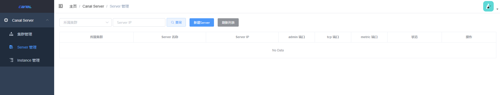

[TOC]

## 一、安装 MySQL 

[QuickStart · alibaba/canal Wiki (github.com)](https://github.com/alibaba/canal/wiki/QuickStart)


### 1.1 启动 mysql 服务器

```bash
docker run --name mysql-canal ^
-p 3306:3306 ^
-e MYSQL_ROOT_PASSWORD=root ^
-d mysql:5.7.36
```


### 1.3 开启 Binlog 写入功能

对于自建 MySQL容器 , 我们需要开启 Binlog 写入功能。


#### 1.3.1创建 binlog 配置文件

在宿主机上创建 `my.cnf` 文件，配置 binlog-format 为 ROW 模式。`my.cnf` 的配置内容如下：

```ini
[mysqld]
# 开启 binlog
log-bin=mysql-bin 
# 选择 ROW 模式
binlog-format=ROW 
# 配置 MySQL replaction 需要定义，不要和 canal 的 slaveId 重复
server_id=1 
```


#### 1.3.2 修改配置文件权限

进入 MySQL 容器并修改 MySQL 容器配置文件  `/etc/mysql/my.cnf`  权限，以避免权限警告：

```bash
# 进入 MySQL 容器
$ docker exec -it mysql-canal bash

# 修改文件权限
$ chmod 644 /etc/mysql/my.cnf
$ exit
```

注意，在没有修改配置文件并启动 MySQL 容器情况下，MySQL 会警告配置文件 `/etc/mysql/my.cnf` [权限设置不当](https://stackoverflow.com/questions/53741107/mysql-in-docker-on-ubuntu-warning-world-writable-config-file-is-ignored)，允许所有用户写入（world-writable）。<font color="red">**由于安全原因，MySQL 会忽略这个配置文件**</font>。

```
[Warning] World-writable config file '/etc/mysql/my.cnf' is ignored.
```


#### 1.3.2 挂载配置文件

在 MySQL 容器运行后，使用以下命令将创建的 `my.cnf` 文件挂载到容器内的 `/etc/mysql/my.cnf`：

```bash
# 将本地的 my.cnf 文件复制到容器的指定目录下
$ docker cp D:\Learning\java-demos\middleware-demos\spring-boot-canal\src\main\resources\conf\my.cnf mysql-canal:/etc/mysql/

# 为了使新的配置生效，重启 MySQL 容器
$ docker restart mysql-canal
```

注意，MySQL 容器的 `/etc/mysql/my.cnf` 是一个符号链接，直接指定完整路径时会导致问题。

>  MySQL 启动时会首先加载主配置文件 `/etc/mysql/my.cnf`，然后加载 `conf.d` 目录下的所有配置文件。


#### 1.3.4 检测 binlog 配置是否成功

进入 MySQL， 利用  `show variables like 'log_bin';`  查看是否打开 binlog 模式：

```bash
$ docker exec -it mysql-canal bash

# 查看挂载后的 my.cnf 文件
$ tail /etc/mysql/my.cnf

# 查看 binlog 是否开启
$ mysql -uroot -proot
mysql> show variables like 'log_bin';
+---------------+-------+
| Variable_name | Value |
+---------------+-------+
| log_bin       | ON    |
+---------------+-------+
1 row in set (0.01 sec)

# 查看 binlog 日志文件列表
mysql> show binary logs;

# 查看正在写入的 binlog 文件
mysql> show master status;

# 查看 Binlog 文件内容
mysql> mysqlbinlog /var/lib/mysql/mysql-bin.000001


```


### 1.4 创建账户并授权

授权 canal 链接 MySQL 账号具有作为 MySQL slave 的权限, 如果已有账户可直接 grant

```bash
# 进入 mysql 容器
$ docker exec -it mysql-canal mysql -uroot -proot

# 创建用户名和密码都为 canal 的账户
mysql> CREATE USER canal IDENTIFIED BY 'canal';

# 授予权限 GRANT ALL PRIVILEGES ON *.* TO 'canal'@'%' ;
mysql> GRANT SELECT, REPLICATION SLAVE, REPLICATION CLIENT ON *.* TO 'canal'@'%';
FLUSH PRIVILEGES;
```


## 二、安装 canal

canal-server 和  canal-admin 在 Docker 里面的详细教程查看 [Docker QuickStart · alibaba/canal Wiki](https://github.com/alibaba/canal/wiki/Docker-QuickStart) 和 [Canal Admin Docker · alibaba/canal Wiki](https://github.com/alibaba/canal/wiki/Canal-Admin-Docker)。

### 2.1 安装 canal-admin(可选)

#### 2.1.1 启动 canal-admin 容器

```bash
$ docker pull canal/canal-admin:v1.1.7

$ docker run -d ^
--name canal-admin ^
--privileged=true ^
--restart always ^
-p 8089:8089 ^
-e server.port=8089 ^
-e canal.adminUser=admin ^
-e canal.adminPasswd=admin ^
-m 512m ^
canal/canal-admin:v1.1.7
```

在 canal 启动成功后，查看 admin 日志

```
2024-10-28 21:35:01 DOCKER_DEPLOY_TYPE=VM
2024-10-28 21:35:01 ==> INIT /alidata/init/02init-sshd.sh
2024-10-28 21:35:01 ==> EXIT CODE: 0
2024-10-28 21:35:01 ==> INIT /alidata/init/fix-hosts.py
2024-10-28 21:35:01 ==> EXIT CODE: 0
2024-10-28 21:35:01 ==> INIT DEFAULT
2024-10-28 21:35:01 ==> INIT DONE
2024-10-28 21:35:01 ==> RUN /home/admin/app.sh
2024-10-28 21:35:01 ==> START ...
2024-10-28 21:35:01 Failed to get D-Bus connection: Operation not permitted
2024-10-28 21:35:01 Failed to get D-Bus connection: Operation not permitted
2024-10-28 21:35:01 start mysql ...
2024-10-28 21:35:10 mysql: [Warning] Using a password on the command line interface can be insecure.
2024-10-28 21:35:10 start mysql successful
2024-10-28 21:35:10 start admin ...
2024-10-28 21:35:15 start canal successful
2024-10-28 21:35:15 ==> START SUCCESSFUL ...
```


#### 2.1.2 访问页面

访问 http://127.0.0.1:8089/ ，默认账号密码为 admin/123456




### 2.2 安装 canal-server

#### 2.2.1 启动 canal 容器

```bash
$ docker pull canal/canal-server:v1.1.7

$ docker run -d ^
  --name canal-server ^
  --restart always ^
  -p 11111:11111 ^
  --privileged=true ^
  -e canal.destinations=test ^
  -e canal.instance.mysql.slaveId=1234  ^
  -e canal.instance.master.address=172.17.0.4:3306 ^
  -e canal.instance.dbUsername=canal ^
  -e canal.instance.dbPassword=canal ^
  -e canal.instance.connectionCharset=UTF-8 ^
  -e canal.instance.tsdb.enable=true ^
  -e canal.instance.gtidon=false ^
  -e canal.instance.filter.regex=.\*\\\\..\* ^
  -m 4096m ^
  canal/canal-server:v1.1.7

```


#### 2.2.2 查看启动日志

在 canal 启动成功后，查看启动日志

```
2024-10-28 21:29:00 DOCKER_DEPLOY_TYPE=VM
2024-10-28 21:29:00 ==> INIT /alidata/init/02init-sshd.sh
2024-10-28 21:29:00 ==> EXIT CODE: 0
2024-10-28 21:29:00 ==> INIT /alidata/init/fix-hosts.py
2024-10-28 21:29:00 ==> EXIT CODE: 0
2024-10-28 21:29:00 ==> INIT DEFAULT
2024-10-28 21:29:00 ==> INIT DONE
2024-10-28 21:29:00 ==> RUN /home/admin/app.sh
2024-10-28 21:29:01 ==> START ...
2024-10-28 21:29:01 start canal ...
2024-10-28 21:29:00 Failed to get D-Bus connection: Operation not permitted
2024-10-28 21:29:00 Failed to get D-Bus connection: Operation not permitted
2024-10-28 21:29:36 start canal successful
2024-10-28 21:29:36 ==> START SUCCESSFUL ...
```

看到 successful 之后，就代表 canal-server 启动成功，然后就可以在 canal-admin 上进行任务分配了。


## 四、客户端代码

### 4.1 导入依赖

创建 Spring Boot 项目，并导入以下依赖。

```xml
<dependency>
    <groupId>com.alibaba.otter</groupId>
    <artifactId>canal.client</artifactId>
    <version>1.1.7</version>
</dependency>

<!-- Message、CanalEntry.Entry等来自此安装包 -->
<dependency>
    <groupId>com.alibaba.otter</groupId>
    <artifactId>canal.protocol</artifactId>
    <version>1.1.7</version>
</dependency>
```


### 4.2 简单案例代码

编写简单的案例打印 canal server 解析 binlog 获得的实体类信息， 具体代码如下：

```java
public class SimpleCanalClientExample {
    /**
     * 主函数入口
     * <p>
     *     建立与Canal服务器的连接，订阅数据库变化，并处理接收到的消息
     * </p>
     *
     * @param args 命令行参数
     */
    public static void main(String[] args) {
        // 创建链接
        CanalConnector connector = CanalConnectors.newSingleConnector(new InetSocketAddress("127.0.0.1",
                11111), "test", "", "");
        // 批处理大小，即每次获取的最大消息数量
        int batchSize = 1000;
        // 连续接收到空消息的次数
        int emptyCount = 0;
        try {
            // 建立连接
            connector.connect();
            // 订阅所有数据库和表的变化
            connector.subscribe(".*\\..*");
            // 回滚到未确认的消息
            connector.rollback();
            // 最大连续接收到空消息的次数
            int totalEmptyCount = 1200;
            // 循环获取消息，直到连续接收到空消息的次数超过totalEmptyCount
            while (emptyCount < totalEmptyCount) {
                // 获取指定数量的数据
                Message message = connector.getWithoutAck(batchSize);
                // 获取消息ID
                long batchId = message.getId();
                // 获取消息中的数据条目数量
                int size = message.getEntries().size();
                // 如果消息ID为-1或数据条目数量为0，则增加空消息计数
                if (batchId == -1 || size == 0) {
                    emptyCount++;
                    System.out.println("empty count : " + emptyCount);
                    // 空消息过多时休眠1秒
                    try {
                        Thread.sleep(1000);
                    } catch (InterruptedException e) {
                    }
                } else {
                    // 如果接收到数据，则重置空消息计数
                    emptyCount = 0;
                    // 打印接收到的消息信息
                    // System.out.printf("message[batchId=%s,size=%s] \n", batchId, size);
                    printEntry(message.getEntries());
                }
                // 提交确认
                connector.ack(batchId);
                // 处理失败, 回滚数据
                // connector.rollback(batchId);
            }
            // 如果连续接收到的空消息次数过多，则退出
            System.out.println("empty too many times, exit");
        } finally {
            // 断开连接
            connector.disconnect();
        }
    }

    /**
     * 打印 canal server 解析 binlog 获得的实体类信息
     * <p>
     *     遍历给定的 entry 列表，解析并打印每个 entry 的详细信息除非 entry 类型是事务开始或结束
     *     对于非事务 entry，解析其存储值为 RowChange 对象，并根据事件类型打印变更信息
     * </p>
     *
     * @param entrys 条目列表，代表一系列数据库变更事件
     */
    private static void printEntry(List<Entry> entrys) {
        for (Entry entry : entrys) {
            // 跳过事务开始和事务结束的 entry
            if (entry.getEntryType() == EntryType.TRANSACTIONBEGIN || entry.getEntryType() == EntryType.TRANSACTIONEND) {
                continue;
            }

            RowChange rowChage = null;
            try {
                // 从 entry 的存储值中解析出 RowChange 对象
                rowChage = RowChange.parseFrom(entry.getStoreValue());
            } catch (Exception e) {
                // 如果解析失败，抛出运行时异常，并提供错误信息和原始异常
                throw new RuntimeException("ERROR ## parser of eromanga-event has an error , data:" + entry.toString(),
                        e);
            }

            // 获取事件类型，并打印 entry 的基本信息
            EventType eventType = rowChage.getEventType();
            System.out.println(String.format("================&gt; binlog[%s:%s] , name[%s,%s] , eventType : %s",
                    entry.getHeader().getLogfileName(), entry.getHeader().getLogfileOffset(),
                    entry.getHeader().getSchemaName(), entry.getHeader().getTableName(),
                    eventType));

            // 遍历 RowChange 中的所有行数据，并根据事件类型打印相应的列信息
            for (RowData rowData : rowChage.getRowDatasList()) {
                switch (eventType) {
                    case DELETE:
                        // 对于删除事件，打印行数据的"之前"状态
                        printColumn(rowData.getBeforeColumnsList());
                        break;
                    case UPDATE:
                        // 对于插入事件，打印行数据的"之后"状态
                        printColumn(rowData.getAfterColumnsList());
                        break;
                    default:
                        // 对于其他事件类型，打印行数据的"之前"和"之后"状态
                        System.out.println("-------&gt; before");
                        printColumn(rowData.getBeforeColumnsList());
                        System.out.println("-------&gt; after");
                        printColumn(rowData.getAfterColumnsList());
                }
            }
        }
    }


    /**
     * 打印列信息
     * 此方法接收一个Column对象列表作为参数，并遍历该列表，将每个Column对象的名称、值和更新状态打印到控制台
     * 主要用途是用于调试或日志记录，以直观地展示每个列的信息及其更新状态
     *
     * @param columns Column对象列表，包含要打印的列信息每个Column对象都应提供getName、getValue和getUpdated方法
     */
    private static void printColumn(List<Column> columns) {
        // 遍历Column对象列表
        for (Column column : columns) {
            // 打印每个Column对象的名称、值和更新状态
            System.out.println(column.getName() + " : " + column.getValue() + "    update=" + column.getUpdated());
        }
    }
}
```


## 五、测试

### 5.1 创建数据库及表

数据库变更：

```sql
CREATE DATABASE test_db;
USE test_db;
CREATE TABLE users (
    id INT PRIMARY KEY AUTO_INCREMENT,
    name VARCHAR(100),
    email VARCHAR(100)
);
```

控制台输出：

```bash
================&gt; binlog[mysql-bin.000004:1234] , name[test_db,] , eventType : QUERY
================&gt; binlog[mysql-bin.000004:219] , name[test,users] , eventType : CREATE
```


### 5.2 插入数据

插入语句：

```sql
INSERT INTO users (name, email) VALUES ('Alice', 'alice@example.com');
INSERT INTO users (name, email) VALUES ('Bob', 'bob@example.com');
```
控制台输出：
```bash
================&gt; binlog[mysql-bin.000004:595] , name[test,users] , eventType : INSERT
id : 1    update=true
name : Alice    update=true
email : alice@example.com    update=true

================&gt; binlog[mysql-bin.000004:883] , name[test,users] , eventType : INSERT
id : 2    update=true
name : Bob    update=true
email : bob@example.com    update=true
```


### 5.3 更新数据

更新语句：

```sql
UPDATE users SET email = 'newemail@example.com' WHERE name = 'Bob';
```

控制台输出：

```bash
================&gt; binlog[mysql-bin.000004:2370] , name[test_db,users] , eventType : UPDATE
id : 2    update=false
name : Bob    update=false
email : newemail@example.com    update=true
```


## 参考资料

[ClientExample · alibaba/canal Wiki](https://github.com/alibaba/canal/wiki/ClientExample) 

[超详细的canal入门，看这篇就够了-阿里云开发者社区 (aliyun.com)](https://developer.aliyun.com/article/770496)

[【Canal】Canal Admin Docker部署 - H__D - 博客园](https://www.cnblogs.com/h--d/p/18102779)