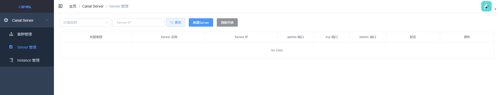
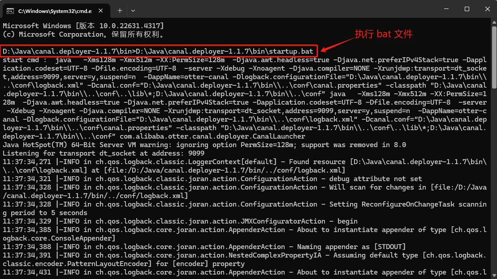

[TOC]

## 一、安装 canal-admin

canal-admin 在 Docker 中的详细安装教程请查看 [Canal Admin Docker · alibaba/canal Wiki](https://github.com/alibaba/canal/wiki/Canal-Admin-Docker)。

canal-admin 文件存放在容器的 `/home/admin/canal-admin` 目录下。


### 1.1 拉取镜像

使用以下命令拉取 canal-admin 镜像：

```
$ docker pull canal/canal-admin:v1.1.7
```

canal-admin 的限定依赖：

1. MySQL，用于存储配置和节点等相关数据
2. canal版本，要求>=1.1.4 (需要依赖canal-server提供面向admin的动态运维管理接口)


### 1.2 启动 canal-admin 容器(使用脚本)

#### 1.2.1 下载脚本 

在 canal 仓库的 docker 目录下自带 `run_admin.sh` 脚本，可以通过 wget 命令来下载  [run_admin.sh](https://github.com/alibaba/canal/blob/master/docker/run_admin.sh) 脚本

```
# 下载脚本
wget https://raw.githubusercontent.com/alibaba/canal/master/docker/run_admin.sh 
```

`run_admin.sh` 脚本的部分内容如下：

```sh
#!/bin/bash

function usage() {
    echo "Usage:"
    echo "  run_admin.sh [CONFIG]"
    echo "example :"
    echo "  run_admin.sh -e server.port=8089 \\"
    echo "         -e canal.adminUser=admin \\"
    echo "         -e canal.adminPasswd=admin"
    exit
}


MEMORY="-m 1024m"
LOCALHOST=`getMyIp`
cmd="docker run -d --privileged=true -it -h $LOCALHOST $CONFIG --name=canal-admin $VOLUMNS $NET_MODE $PORTS $MEMORY canal/canal-admin"
echo $cmd
eval $cmd
```

可以看到，该脚本的本质是执行生成 `docker run` 语句并执行。


#### 1.2.2 执行脚本

使用以下命令执行脚本，启动 canal-admin 容器。

```bash
# 不指定数据库
$ sh run_admin.sh -e server.port=8089 \
         -e canal.adminUser=admin \
         -e canal.adminPasswd=admin


# 指定外部的mysql作为admin的数据库
$ sh  run_admin.sh -e server.port=8089 \
       -e spring.datasource.address=127.0.0.1:3306 \
	   -e spring.datasource.database=canal_manager  \
       -e spring.datasource.username=root  \
       -e spring.datasource.password=root  
```

该命令生成的 docker run 语句内容如下：

```shell
# 不指定数据库
$ docker run -d --privileged=true -it -h -e server.port=8089 -e canal.adminUser=admin -e canal.adminPasswd=admin --name=canal-admin --net=host -m 1024m canal/canal-admin


# 指定外部的mysql作为admin的数据库
docker run -d --privileged=true -it -h -e server.port=8089 -e spring.datasource.address=127.0.0.1:3306 -e spring.datasource.database=canal_manager -e spring.datasource.username=root -e spring.datasource.password=root --name=canal-admin --net=host -m 1024m canal/canal-admin
```

> 事实上，这个可以不用指定数据库。如果要指定数据库的话，还需要初始化数据库


#### 1.2.3 初始化元数据库(可选)

执行 `canal_manager.sql` 文件：

```
source conf/canal_manager.sql
```

- 初始化SQL脚本里会默认创建 `canal_manager` 的数据库，建议使用 root 等有超级权限的账号进行初始化 
- `canal_manager.sql` 默认会在 `/home/admin/canal-admin/conf` 目录下，也可以通过链接下载 [canal_manager.sql](https://raw.githubusercontent.com/alibaba/canal/master/canal-admin/canal-admin-server/src/main/resources/canal_manager.sql)


### 1.3 启动 canal-admin 容器(直接使用 Docker 命令)

在 canal-admin 里面找不到数据库文件被删除，似乎不推荐使用外部数据库。

#### 1.3.1 启动容器

不指定数据库，启动容器。

```bash
$ docker run -d ^
--name canal-admin ^
--privileged=true ^
--restart always ^
-p 8089:8089 ^
-e server.port=8089 ^
-m 1024m ^
canal/canal-admin:v1.1.7
```


#### 1.3.2 查看启动日志

在 canal 启动成功后，查看  admin启动日志为：

```
2024-10-28 19:54:00 DOCKER_DEPLOY_TYPE=VM
2024-10-28 19:54:00 ==> INIT /alidata/init/02init-sshd.sh
2024-10-28 19:54:00 ==> EXIT CODE: 0
2024-10-28 19:54:00 ==> INIT /alidata/init/fix-hosts.py
2024-10-28 19:54:00 ==> EXIT CODE: 0
2024-10-28 19:54:00 ==> INIT DEFAULT
2024-10-28 19:54:00 ==> INIT DONE
2024-10-28 19:54:00 ==> RUN /home/admin/app.sh
2024-10-28 19:54:01 ==> START ...
2024-10-28 19:54:01 start mysql ...
2024-10-28 19:54:10 start mysql successful
2024-10-28 19:54:10 start admin ...
2024-10-28 19:54:15 start canal successful
2024-10-28 19:54:15 ==> START SUCCESSFUL ...
2024-10-28 19:54:00 Failed to get D-Bus connection: Operation not permitted
2024-10-28 19:54:00 Failed to get D-Bus connection: Operation not permitted
2024-10-28 19:54:10 mysql: [Warning] Using a password on the command line interface can be insecure.
```


### 1.4  访问页面

访问 http://127.0.0.1:8089/ ，默认账号密码为 admin/123456 .




## 二、 安装 canal-server

[Docker QuickStart · alibaba/canal Wiki](https://github.com/alibaba/canal/wiki/Docker-QuickStart)

### 2.1 拉取镜像

```bash
$ docker pull canal/canal-server:v1.1.7
```

canal-server 的软件目录为：

```
drwxr-xr-x 2 jianghang jianghang  136 2013-02-05 21:51 bin
drwxr-xr-x 4 jianghang jianghang  160 2013-02-05 21:51 conf
drwxr-xr-x 2 jianghang jianghang 1.3K 2013-02-05 21:51 lib
drwxr-xr-x 2 jianghang jianghang   48 2013-02-05 21:29 logs
```


### 2.2 启动 canal 容器（使用脚本）

#### 2.2.1 下载脚本

在 canal 仓库的 docker 目录下自带 `run.sh` 脚本，下载  [run.sh](https://github.com/alibaba/canal/blob/master/docker/run.sh) 脚本

```bash
# 下载脚本
wget https://raw.githubusercontent.com/alibaba/canal/master/docker/run.sh 
```

`run.sh` 脚本的部分内容如下：

```sh
#!/bin/bash

function usage() {
    echo "Usage:"
    echo "  run.sh [CONFIG]"
    echo "example 1 :"
    echo "  run.sh -e canal.instance.master.address=127.0.0.1:3306 \\"
    echo "         -e canal.instance.dbUsername=canal \\"
    echo "         -e canal.instance.dbPassword=canal \\"
    echo "         -e canal.instance.connectionCharset=UTF-8 \\"
    echo "         -e canal.instance.tsdb.enable=true \\"
    echo "         -e canal.instance.gtidon=false \\"
    echo "         -e canal.instance.filter.regex=.*\\\\\\..* "
    echo "example 2 :"
    echo "  run.sh -e canal.admin.manager=127.0.0.1:8089 \\"
    echo "         -e canal.admin.port=11110 \\"
    echo "         -e canal.admin.user=admin \\"
    echo "         -e canal.admin.passwd=4ACFE3202A5FF5CF467898FC58AAB1D615029441"
    exit
}

...

MEMORY="-m 4096m"
LOCALHOST=`getMyIp`
cmd="docker run -d --privileged=true -it -h $LOCALHOST $CONFIG --name=canal-server $VOLUMNS $NET_MODE $PORTS $MEMORY canal/canal-server"
echo $cmd
eval $cmd
```

可以看到，该脚本的本质是执行生成 `docker run` 语句并执行。


#### 2.2.2 执行脚本

```bash
# 以单机模式启动，构建一个destination name为test的队列
sh run.sh -e canal.auto.scan=false \
		  -e canal.destinations=test \
		  -e canal.instance.master.address=127.0.0.1:3306  \
		  -e canal.instance.dbUsername=canal  \
		  -e canal.instance.dbPassword=canal  \
		  -e canal.instance.connectionCharset=UTF-8 \
		  -e canal.instance.tsdb.enable=true \
		  -e canal.instance.gtidon=false  \
		  -e canal.admin.manager=127.0.0.1:8089 \
          -e canal.admin.port=11110 \
          -e canal.admin.user=admin \
          -e canal.admin.passwd=4ACFE3202A5FF5CF467898FC58AAB1D615029441
```

- -e 参数里可以指定以前 canal.properties/instance.properties 里的所有配置的 key 和 value，canal-server 启动时会有限读取-e指定的变量，具体可参考[AdminGuide](https://github.com/alibaba/canal/wiki/AdminGuide)
- docker 模式下，单docker实例只能运行一个 instance，主要为配置问题。如果需要运行多instance 时，可以自行制作一份 docker 镜像即可

等价的 docker 命令为：

```sh
docker run -d --privileged=true -it -h -e canal.auto.scan=false -e canal.destinations=test -e canal.instance.master.address=127.0.0.1:3306 -e canal.instance.dbUsername=canal -e canal.instance.dbPassword=canal -e canal.instance.connectionCharset=UTF-8 -e canal.instance.tsdb.enable=true -e canal.instance.gtidon=false -e canal.admin.manager=127.0.0.1:8089 -e canal.admin.port=11110 -e canal.admin.user=admin -e canal.admin.passwd=4ACFE3202A5FF5CF467898FC58AAB1D615029441 --name=canal-server --net=host -m 4096m canal/canal-server
```


### 2.3 启动 canal-admin 容器(使用挂载)

#### 2.3.1 配置文件

修改 `example/instance.properties` 文件：

```
# position info
canal.instance.master.address=host.docker.internal:3306

# username/password
canal.instance.dbUsername=canal
canal.instance.dbPassword=canal

# table regex
canal.instance.filter.regex=.\*\\\\..\*

# mq config
canal.mq.topic=example
```

修改 `canal.properties` 文件：

```
#################################################
######### 		common argument		#############
#################################################
# canal admin config
canal.admin.manager = host.docker.internal:8089

#################################################
######### 		destinations		#############
#################################################
canal.destinations = test
canal.auto.scan = false
```


#### 2.3.1 启动容器

使用挂载启动容器。

```bash
docker run -d ^
-p 11111:11111 ^
--name canal-server ^
-v D:\Learning\java-demos\middleware-demos\spring-boot-canal\src\main\resources\canal\conf\example\instance.properties:/home/admin/canal-server/conf/example/instance.properties ^
canal/canal-server:v1.1.7

```


#### 2.3.2 查看启动日志

[QuickStart · alibaba/canal Wiki](https://github.com/alibaba/canal/wiki/QuickStart)

在 canal 启动成功后，查看  admin启动日志为：

```
2024-10-28 20:31:39 DOCKER_DEPLOY_TYPE=VM
2024-10-28 20:31:39 ==> INIT /alidata/init/02init-sshd.sh
2024-10-28 20:31:39 ==> EXIT CODE: 0
2024-10-28 20:31:39 ==> INIT /alidata/init/fix-hosts.py
2024-10-28 20:31:39 ==> EXIT CODE: 0
2024-10-28 20:31:39 ==> INIT DEFAULT
2024-10-28 20:31:39 Failed to get D-Bus connection: Operation not permitted
2024-10-28 20:31:39 Failed to get D-Bus connection: Operation not permitted
2024-10-28 20:31:39 ==> INIT DONE
2024-10-28 20:31:39 ==> RUN /home/admin/app.sh
2024-10-28 20:31:40 ==> START ...
2024-10-28 20:31:40 start canal ...
2024-10-28 20:32:16 start canal successful
2024-10-28 20:32:16 ==> START SUCCESSFUL ...
```

看到 successful 之后，就代表 canal-server 启动成功，然后就可以在 canal-admin 上进行任务分配了


查看 server 日志

```bash
$ tail /home/admin/canal-server/logs/canal/canal.log
2024-10-29 05:55:22.779 [main] INFO  com.alibaba.otter.canal.deployer.CanalLauncher - ## set default uncaught exception handler
2024-10-29 05:55:22.785 [main] INFO  com.alibaba.otter.canal.deployer.CanalLauncher - ## load canal configurations
2024-10-29 05:55:22.791 [main] INFO  com.alibaba.otter.canal.deployer.CanalStarter - ## start the canal server.
2024-10-29 05:55:22.812 [main] INFO  com.alibaba.otter.canal.deployer.CanalController - ## start the canal server[172.17.0.3(172.17.0.3):11111]
2024-10-29 05:55:23.678 [main] INFO  com.alibaba.otter.canal.deployer.CanalStarter - ## the canal server is running now ......

```


查看 instance 的日志

```bash
$ tail /home/admin/canal-server/logs/test/test.log
2024-10-29 03:29:41.338 [main] ERROR c.a.o.canal.instance.manager.PlainCanalInstanceGenerator - generator instance failed.
com.alibaba.otter.canal.common.CanalException: instance : test config is not found


$ tail /home/admin/canal-server/logs/example/example.log


```


### 2.4 启动容器(推荐)

在配置参数较少时，个人比较喜欢的方式是只用使用 Docker 命令运行即可。

```bash
 $ docker run -d ^
      --name canal-server ^
      --restart always ^
      -p 11111:11111 ^
      --privileged=true ^
      -e canal.destinations=test ^
      -e canal.instance.mysql.slaveId=1234  ^
      -e canal.instance.master.address=172.17.0.4:3306 ^
      -e canal.instance.dbUsername=canal ^
      -e canal.instance.dbPassword=canal ^
      -e canal.instance.connectionCharset=UTF-8 ^
      -e canal.instance.tsdb.enable=true ^
      -e canal.instance.gtidon=false ^
      -e canal.instance.filter.regex=.\*\\\\..\* ^
      -m 4096m ^
      canal/canal-server:v1.1.7
```


## 三、安装 canal-deployer

canal-ployer 实际上就是 canal-server 的压缩文件，可以在本地启动。

### 3.1 下载 canal-deployer

在 [canal 官网](https://github.com/alibaba/canal/releases)，下载 `canal.deployer-1.1.7.tar.gz` 并解压缩到指定目录。


### 3.2 修改配置文件

修改配置文件 `/conf/canal.properties`

```properties
#################################################
######### 		common argument		#############
#################################################
# tcp, kafka, rocketMQ, rabbitMQ, pulsarMQ
canal.serverMode = rocketMQ

#################################################
######### 		destinations		#############
#################################################
canal.destinations = example

##################################################
######### 	      MQ Properties      #############
##################################################
canal.mq.flatMessage = true
canal.auto.scan = false

##################################################
######### 		    RocketMQ	     #############
##################################################
rocketmq.producer.group = my-producer_canal-test-topic
rocketmq.enable.message.trace = false
rocketmq.customized.trace.topic =
rocketmq.namespace =
rocketmq.namesrv.addr = 127.0.0.1:9876
rocketmq.retry.times.when.send.failed = 0
rocketmq.vip.channel.enabled = false
rocketmq.tag =
```

修改 `/conf//example/instance.properties` 配置文件

```properties
canal.instance.master.address=127.0.0.1:3306

canal.instance.dbUsername=canal
canal.instance.dbPassword=canal

# table regex
canal.instance.filter.regex=.*\\..*

# mq config
canal.mq.topic=canal-test-topic
```


### 3.3 启动 canal

执行 `\canal.deployer-1.1.7\bin\startup.bat`  文件




## 四、日志文件

### 4.1 查看日志

Canal 的日志文件较多，以下是常用日志的查看方法：

**a.查看 logs/canal/canal.log**

```bash
docker exec -it canal-server /bin/bash -c "tail -f /home/admin/canal-server/logs/canal/canal.log"
```

**b.查看 /logs/canal/rocketmq_client.log**

实时查看 canal 连接 RocketMQ 客户端日志：

```bash
$ docker exec -it canal-server /bin/bash -c "tail -f /home/admin/canal-server/logs/canal/rocketmq_client.log"
```

**c. 查看instance的日志**

查看特定实例的日志，替换 `test` 为你的实例名称：

```bash
docker exec -it canal-server /bin/bash -c "tail -f /home/admin/canal-server/logs/test/test.log"
```

**d.查看instance的 meta.log 日志**

每执行一次数据库操作，`meta.log` 日志中会生成一条记录。

```bash
docker exec -it canal-server /bin/bash -c "tail -f /home/admin/canal-server/logs/test/meta.log"
```


## 参考资料

[Docker QuickStart · alibaba/canal Wiki](https://github.com/alibaba/canal/wiki/Docker-QuickStart)

[Canal Admin Docker · alibaba/canal Wiki](https://github.com/alibaba/canal/wiki/Canal-Admin-Docker)