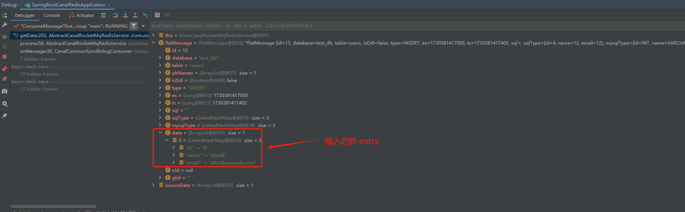

### FlatMessage 类

`com.alibaba.otter.canal.protocol.FlatMessage` 的部分字段如下所示：

```
/**
 * FlatMessage 类表示一个平面消息对象，用于序列化和反序列化
 * 它封装了数据库事件的相关信息，如数据库名称、表名称、事件类型等
 * 主要用于数据同步和事件处理场景
 */
public class FlatMessage implements Serializable {
    /**
     * 序列化版本ID，用于序列化和反序列化时确保类的一致性
     */
    private static final long serialVersionUID = -3386650678735860050L;
    
    /**
     * 消息的唯一标识符
     */
    private long id;
    
    /**
     * 事件发生的数据库名称
     */
    private String database;
    
    /**
     * 事件发生的表名称
     */
    private String table;
    
    /**
     * 主键名称列表，用于标识事件中涉及的主键字段
     */
    private List<String> pkNames;
    
    /**
     * 标识是否为DDL（数据定义语言）事件
     */
    private Boolean isDdl;
    
    /**
     * 事件类型，描述了数据库操作的类型（如INSERT、UPDATE、DELETE等）
     */
    private String type;
    
    /**
     * 事件的结束时间戳
     */
    private Long es;
    
    /**
     * 事件的开始时间戳
     */
    private Long ts;
    
    /**
     * 与事件相关的SQL语句
     */
    private String sql;
    
    /**
     * 存储字段的SQL类型映射，键为字段名，值为SQL类型
     */
    private Map<String, Integer> sqlType;
    
    /**
     * 存储字段的MySQL类型映射，键为字段名，值为MySQL类型
     */
    private Map<String, String> mysqlType;
    
    /**
     * 存储事件的数据，每个Map代表一行数据，其中键为字段名，值为字段值
     */
    private List<Map<String, String>> data;
    
    /**
     * 存储事件的旧数据，用于UPDATE和DELETE操作，格式与data相同
     */
    private List<Map<String, String>> old;
    
    /**
     * GTID（全局事务标识符），用于标识MySQL中的事务
     */
    private String gtid;
}
```


### FlatMessage 的简单案例

执行以下语句：

```
INSERT INTO users (name, email) VALUES ('Alice1', 'alice@example.com');
```

查看相应的 FlatMessage 信息



