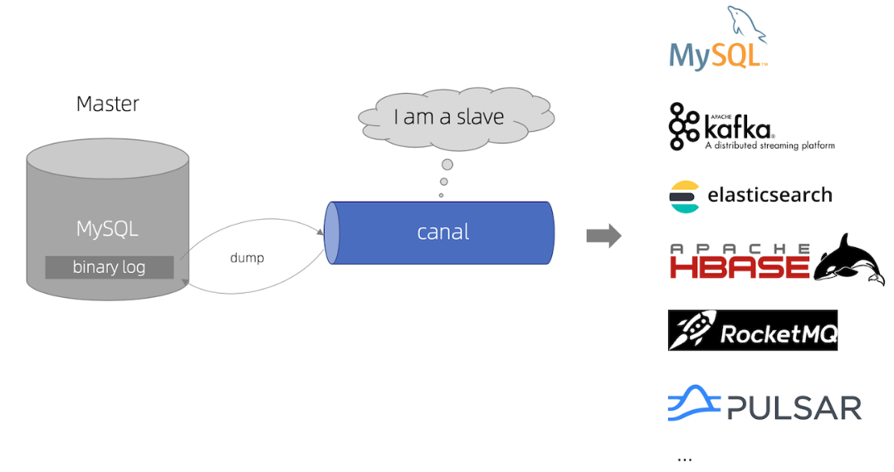
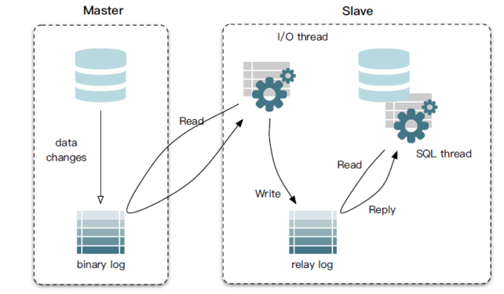
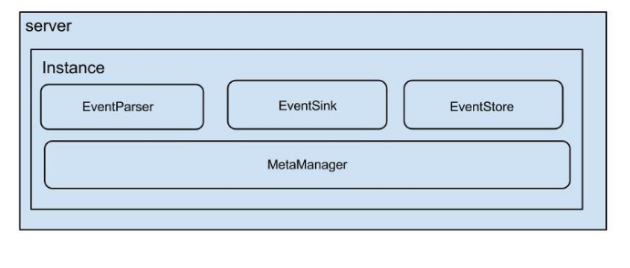
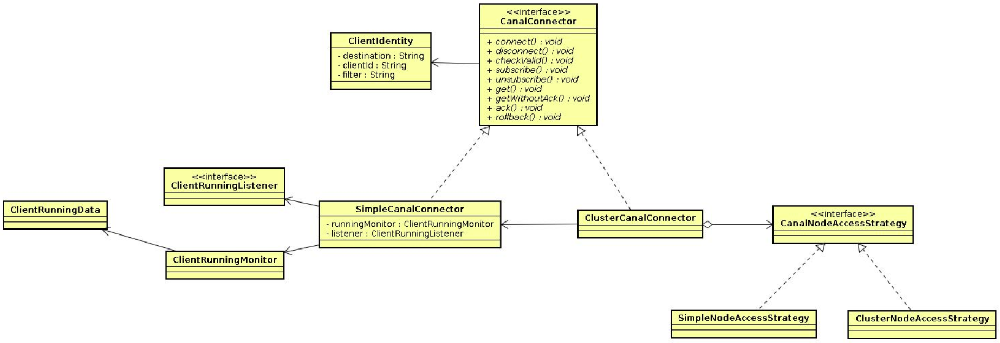
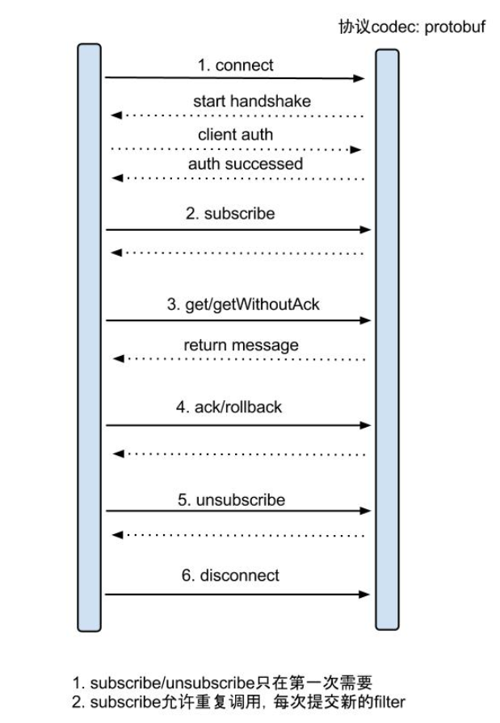

[TOC]

## 一、canal 概述

### 1.2 什么是 canal

[canal](https://github.com/alibaba/canal) 主要用途是基于 MySQL 数据库增量日志解析，提供增量数据订阅和消费。

基于日志增量订阅和消费的业务包括

- 数据库镜像
- 数据库实时备份
- 索引构建和实时维护(拆分异构索引、倒排索引等)
- 业务 cache 刷新
- 带业务逻辑的增量数据处理

### 2.3 canal 的所有组件

Canal 的架构包括多个组件，每个组件承担不同的功能，以便实现高效的数据同步和管理。

- canal.server：**负责处理与数据源的连接和数据的采集**。作为 Canal 的核心，server 组件解析从数据库获取的变更数据，并将其推送到下游。它支持多种数据源，并管理多个实例的运行。
- [canal.client](https://github.com/alibaba/canal/wiki/ClientExample)：**提供了与 canal server 进行通信的客户端接口**。客户端可以订阅特定的数据变更事件，并根据业务需求处理这些事件。Canal 客户端通常用于集成其他应用程序，支持多种编程语言，如 Java、Python 等，方便用户进行数据消费和业务逻辑处理。
- [canal-admin](https://github.com/alibaba/canal/wiki/Canal-Admin-Guide) ：为 canal 提供整体配置管理和节点运维功能的组件，具有友好的 Web UI 操作界面。通过 canal-admin，用户可以轻松管理 Canal 实例的配置、监控实例状态、执行增量订阅等操作。它降低了运维的复杂性，使得更多用户能够快速、安全地操作 canal。

## 二、canal 工作原理

canal 的工作原理主要是将自己伪装成数据库主从同步中的从节点。

### 2.1 MySQL 主备复制原理

- MySQL master 将数据变更写入二进制日志( binary log, 其中记录叫做二进制日志事件binary log events，可以通过 show binlog events 进行查看)
- MySQL slave 将 master 的 binary log events 拷贝到它的中继日志(relay log)
- MySQL slave 重放 relay log 中事件，将数据变更反映它自己的数据

具体细节查看 [MySQL 日志：主从复制是怎么实现](https://xiaolincoding.com/mysql/log/how_update.html#主从复制是怎么实现)

### 2.2 canal 工作原理

- canal 模拟 MySQL slave 的交互协议，伪装自己为 MySQL slave ，向 MySQL master 发送dump 协议
- MySQL master 收到 dump 请求，开始推送 binary log 给 slave (即 canal )
- canal 解析 binary log 对象(原始为 byte 流)

## 三、canal.server 组件

### 3.1 canal.server 的架构

在 canal.server 的架构中，**server** 和 **instance** 是两个重要的概念：

- **server**：代表一个 Canal 运行实例，通常对应于一个 JVM。它负责管理和运行整个 Canal 服务，处理数据源的接入、数据解析、过滤和存储等任务。
- **instance**：对应于一个数据队列，负责从特定数据源（如 MySQL）读取变更数据并将其推送到下游消费者。每个 instance 独立运行，管理特定的数据库连接和数据流。

在实际使用中，通常在 `/canal/conf/canal.properties` 中定义全局的环境和配置，而在 `/canal/conf/example/instance.properties` 中定义具体的数据库实例的连接信息和监控规则。

> 注意，example 是一个 instance 的名字。

### 3.2 instance 模块组成部分

**instance** 模块是其核心部分，负责与数据源的交互和数据的处理:

- **EventParser**：负责数据源的接入，模拟从主数据库（master）到从数据库（slave）的协议交互，并解析从数据库获取的变更数据。

- **EventSink**：充当解析器（Parser）和存储（Store）之间的连接器，负责数据的过滤、加工和分发。它将解析后的数据根据配置进行处理后，推送到目标存储或下游消费者。

- **EventStore**：负责将数据持久化存储，维护已消费的数据记录，以支持增量订阅和历史数据的查询。

- **MetaManager**：负责增量订阅和消费信息的管理，维护每个实例的状态，包括已消费的位置、订阅信息等。

## 四、canal.client 组件

本节内容来源于 [ClientAPI · alibaba/canal Wiki](https://github.com/alibaba/canal/wiki/ClientAPI)

### 4.1 类设计

canal client 提供了一套接口，用于与 canal server 进行交互和数据消费。以下是主要 API 组件的详细说明

- `ClientIdentity`： canal client 和 server 交互之间的身份标识。
- `CanalConnector`：提供两种 connector 的实现。
  - `SimpleCanalConnector` 针对简单的 IP 直连模式，适合单个客户端与单个服务器的连接。
  - `ClusterCanalConnector` 针对多 IP 的模式，可依赖 `CanalNodeAccessStrategy` 进行 failover 控制。
- `CanalNodeAccessStrategy`：提供提供两种 failover 的实现。
  - `SimpleNodeAccessStrategy` 针对给定的初始 IP 列表进行故障转移选择，适用于简单的连接场景。
  - `ClusterNodeAccessStrategy` 基于 Zookeeper 上的集群节点动态选择正在运行的  canal server，适用于更复杂的分布式环境。
- `ClientRunningMonitor/ClientRunningListener/ClientRunningData`： client running 相关控制，主要为解决 client 自身的 failover 机制。

### 4.2 server/clinet 交互协议

### 4.3 使用案例

具体使用案例查看 [ClientExample · alibaba/canal Wiki](https://github.com/alibaba/canal/wiki/ClientExample)

## 参考资料

[Home · alibaba/canal Wiki](https://github.com/alibaba/canal/wiki)

[Canal——原理架构及应用场景 - 曹伟雄 - 博客园](https://www.cnblogs.com/caoweixiong/p/11824423.html)