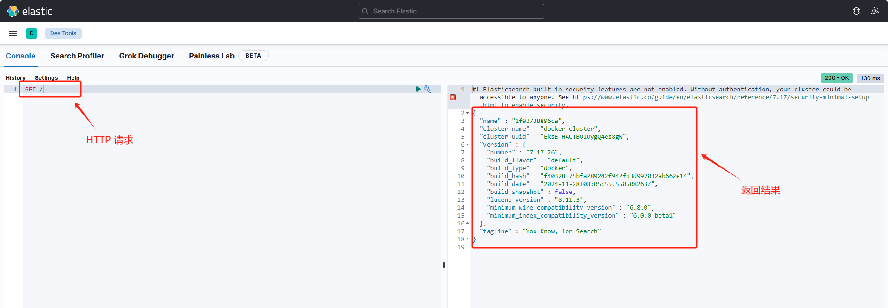

[TOC]

## 一、安装 Elasticsearch

### 1.1 启动 Elasticsearch

运行以下命令启动 Elasticsearch ：

```shell
$ docker network create elastic

$ docker pull docker.elastic.co/elasticsearch/elasticsearch:7.17.26

$ docker run --name es01-test --net elastic -p 127.0.0.1:9200:9200 -p 127.0.0.1:9300:9300 -e "discovery.type=single-node" docker.elastic.co/elasticsearch/elasticsearch:7.17.26
```


### 1.2 启动 Kibana

Kibana 主要用来可视化和管理Elasticsearch数据。

运行以下命令启动 **Kibana**：

```shell
$ docker pull docker.elastic.co/kibana/kibana:7.17.26

$ docker run --name kib01-test --net elastic -p 127.0.0.1:5601:5601 -e "ELASTICSEARCH_HOSTS=http://es01-test:9200" docker.elastic.co/kibana/kibana:7.17.26
```

在启动 Kibana 后，访问 Kibana 可视化界面 [http://localhost:5601](http://localhost:5601/)。


## 二、Elasticsearch 的常见操作

Elasticsearch 数据的 CRUD 操作可以通过发送 HTTP 到 Elasticsearch 来实现。

### 2.1 发送请求到 Elasticsearch 

对于自己部署的 Elasticsearch ，  发送 HTTP 请求到 Elasticsearch  的方式主要有：

- **使用 Kibana Dev Tools**：打开 Kibana 主菜单，点击 **Dev Tools > Console**，在其中直接输入查询或请求。例如：

  

- **使用 curl 工具**：使用命令行工具 [curl](https://curl.se/) 发送请求到 Elasticsearch 。例如

  ```shell
  $ curl -X GET http://localhost:9200/
  ```

  其中，这个请求会返回 Elasticsearch 集群的状态。


### 2.2 添加 Elasticsearch  数据

Elasticsearch 存储数据为**文档**（JSON 对象）。数据将被添加到索引中，可以根据需要创建单个或批量文档。**对于时间序列数据（如日志和指标），通常会使用由多个自动生成的支持索引组成数据流**。数据流的要求有：

- 数据流需要与其名称匹配的索引模板。Elasticsearch 使用此模板来配置流的支持索引。

- 发送到数据流的文档必须具有 `@timemark` 字段。


**（1）添加单个模板**

提交以下索引请求，将单个日志条目添加到 `logs-my_app-default` 数据流中。由于 `logs-my_app-default`不存在，请求会使用内置的 `logs-*-*` 索引模板自动创建它。其中，`_doc` 表示提交端点， `pretty` 表示格式化相应参数。

在 Windows cmd 里面运行以下命令：

```shell
$ curl -X POST "localhost:9200/logs-my_app-default/_doc?pretty" ^
  -H "Content-Type: application/json" ^
  -d "{\"@timestamp\": \"2099-05-06T16:21:15.000Z\", \"event\": {\"original\": \"192.0.2.42 - - [06/May/2099:16:21:15 +0000] \\\"GET /images/bg.jpg HTTP/1.0\\\" 200 24736\"}}"
```

响应包括Elasticsearch为文档生成的元数据：

- `_index`：包含文档的索引名称。。Elasticsearch自动生成支持索引的名称。

- `_id`： 文档在索引中的唯一标识符。

```json
{
  "_index" : ".ds-logs-my_app-default-2024.12.05-000001",
  "_type" : "_doc",
  "_id" : "bDpEl5MBKQkYzCzjxd45",
  "_version" : 1,
  "result" : "created",
  "_shards" : {
    "total" : 2,
    "successful" : 1,
    "failed" : 0
  },
  "_seq_no" : 1,
  "_primary_term" : 1
}
```


**（2）添加多个模板**

使用 `_bulk` 端点，可以在一个请求中批量添加多个文档。每个文档数据行需要是换行符分隔的 JSON（NDJSON）。例如：

```json
POST /_bulk
{ "index": { "_index": "logs-my_app-default", "_id": "1" } }
{ "@timestamp": "2099-05-06T16:21:15.000Z", "event": { "original": "GET /images/bg.jpg HTTP/1.0" } }
{ "index": { "_index": "logs-my_app-default", "_id": "2" } }
{ "@timestamp": "2099-05-06T16:22:15.000Z", "event": { "original": "POST /login HTTP/1.0" } }
```

响应结果为：

```json
{
  "took" : 48,
  "errors" : false,
  "items" : [
    {
      "create" : {
        "_index" : ".ds-logs-my_app-default-2024.12.05-000001",
        "_type" : "_doc",
        "_id" : "bTpHl5MBKQkYzCzjO96I",
        "_version" : 1,
        "result" : "created",
        "_shards" : {
          "total" : 2,
          "successful" : 1,
          "failed" : 0
        },
        "_seq_no" : 2,
        "_primary_term" : 1,
        "status" : 201
      }
    },
    {
      "create" : {
        "_index" : ".ds-logs-my_app-default-2024.12.05-000001",
        "_type" : "_doc",
        "_id" : "bjpHl5MBKQkYzCzjO96I",
        "_version" : 1,
        "result" : "created",
        "_shards" : {
          "total" : 2,
          "successful" : 1,
          "failed" : 0
        },
        "_seq_no" : 3,
        "_primary_term" : 1,
        "status" : 201
      }
    }
  ]
}

```


### 2.3 搜索 Elasticsearch  数据

索引文档可用于近乎实时的搜索。

以下搜索匹配 `logs-my_app-default` 中的所有日志条目，并按 `@timemark` 降序对其进行排序。

```shell
GET logs-my_app-default/_search
{
  "query": {
    "match_all": { }
  },
  "sort": [
    {
      "@timestamp": "desc"
    }
  ]
}
```

具体的返回数据为：

```json
{
  "took" : 583,
  "timed_out" : false,
  "_shards" : {
    "total" : 1,
    "successful" : 1,
    "skipped" : 0,
    "failed" : 0
  },
  "hits" : {
    "total" : {
      "value" : 4,
      "relation" : "eq"
    },
    "max_score" : null,
    "hits" : [
      {
        "_index" : ".ds-logs-my_app-default-2024.12.05-000001",
        "_type" : "_doc",
        "_id" : "bjpHl5MBKQkYzCzjO96I",
        "_score" : null,
        "_source" : {
          "@timestamp" : "2099-05-08T16:25:42.000Z",
          "event" : {
            "original" : """192.0.2.255 - - [08/May/2099:16:25:42 +0000] "GET /favicon.ico HTTP/1.0" 200 3638"""
          }
        },
        "sort" : [
          4081940742000
        ]
      },
      {
        "_index" : ".ds-logs-my_app-default-2024.12.05-000001",
        "_type" : "_doc",
        "_id" : "bTpHl5MBKQkYzCzjO96I",
        "_score" : null,
        "_source" : {
          "@timestamp" : "2099-05-07T16:24:32.000Z",
          "event" : {
            "original" : """192.0.2.242 - - [07/May/2020:16:24:32 -0500] "GET /images/hm_nbg.jpg HTTP/1.0" 304 0"""
          }
        },
        "sort" : [
          4081854272000
        ]
      },
      {
        "_index" : ".ds-logs-my_app-default-2024.12.05-000001",
        "_type" : "_doc",
        "_id" : "bDpEl5MBKQkYzCzjxd45",
        "_score" : null,
        "_source" : {
          "@timestamp" : "2099-05-06T16:21:15.000Z",
          "event" : {
            "original" : """192.0.2.42 - - [06/May/2099:16:21:15 +0000] "GET /images/bg.jpg HTTP/1.0" 200 24736"""
          }
        },
        "sort" : [
          4081767675000
        ]
      },
      ...
    ]
  }
}
```

默认情况下，响应的 `hits` 部分包含最多前 10 个匹配搜索的文档。每个文档的 `_source` 字段包含在索引时提交的原始 JSON 对象。

> 如果想要查看搜索数据的更多操作，查看 [Common search options](https://www.elastic.co/guide/en/elasticsearch/reference/7.17/search-your-data.html#common-search-options).


### 2.4 删除 Elasticsearch  数据

在使用完成后，可以使用 `DELETE` 请求完全删除一个索引（包括其中的所有数据）

```json
DELETE _data_stream/logs-my_app-default
```


## 参考资料

[Quick start | Elasticsearch Guide 7.17](https://www.elastic.co/guide/en/elasticsearch/reference/7.17/getting-started.html)