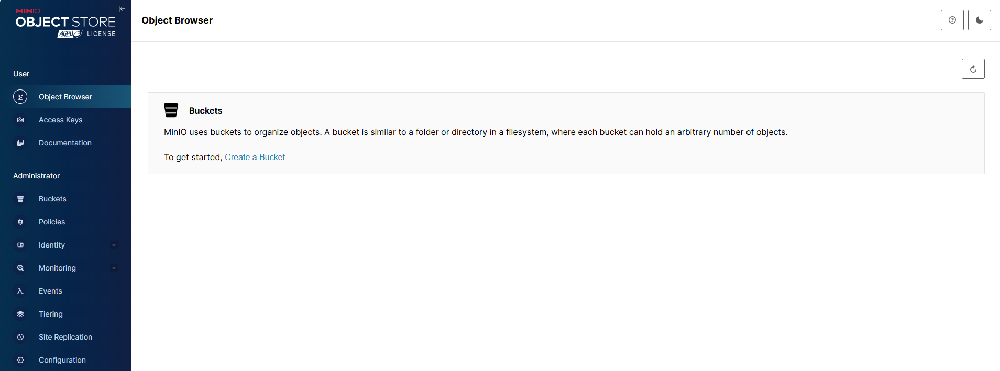
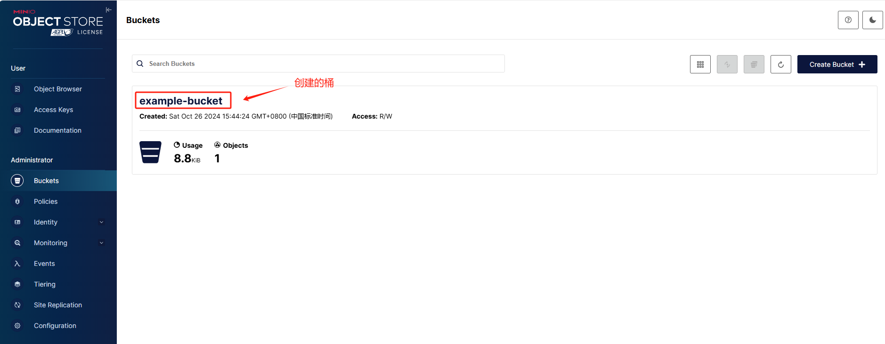

[TOC]

## 一、MinIO 服务端

### 1.1 使用 docker 创建 MinIO 服务

运行以下命令来启动 [MinIO](https://hub.docker.com/r/minio/minio) 服务

```bash
# 拉取镜像
docker pull minio/minio:RELEASE.2024-10-02T17-50-41Z-cpuv1

# 启动容器
docker run ^
--name minio ^
-p 9000:9000 -p 9001:9001 ^
-e "MINIO_ROOT_USER=minio" ^
-e "MINIO_ROOT_PASSWORD=minio123" ^
-v D:\Java\MinIO\data:/data ^
minio/minio:RELEASE.2024-10-02T17-50-41Z-cpuv1 server /data --console-address ":9001"
```

其中，

- **`-e "MINIO_ROOT_USER=minio"`** 和 **`-e "MINIO_ROOT_PASSWORD=minio"`**：设置环境变量以定义 MinIO 的访问密钥和密钥。MinIO 部署时默认的 root 凭据是 `minioadmin:minioadmin`。

- **`-v D:\Java\MinIO\data:/data`**：将主机的 `D:\Java\MinIO\data` 目录挂载到容器的 `/data` 目录，以实现数据持久化。

- **`server /data`**：指示 MinIO 在 `/data` 目录下运行服务器。


### 1.2 访问可视化界面

启动 MinIO 服务后，由于 [MinIO 控制台](https://min.io/docs/minio/container/administration/minio-console.html#logging-in) 已经内置在 MinIO Server 中 ，我们可以通过 [`http://localhost:9001`](http://localhost:9001) 来访问 MinIO 控制台 。




## 二、MinIO 客户端 ( Java )

对于应用程序开发人员，MinIO 提供了多种语言的 SDK。可以通过 [MinIO 官方文档](https://min.io/docs/minio/linux/developers/minio-drivers.html#java)查看支持的 SDK 列表和使用方法，以便在代码中直接访问 MinIO 服务。


### 2.1 创建项目并导入依赖

创建 Spring Boot 项目，并根据 [MinIO download](https://min.io/docs/minio/linux/developers/minio-drivers.html#java) 页面在 `pom.xml` 文件中添加 MinIO Java SDK 的依赖。

```xml
<dependency>
    <groupId>io.minio</groupId>
    <artifactId>minio</artifactId>
    <version>8.5.13</version>
</dependency>
```


### 2.2 编写代码

此示例程序主要实现以下三个功能：

- 连接到对象存储服务器。
- 在服务器上创建一个存储桶 bucket。
- 将文件上传到存储桶。

示例代码如下：

```java
public class MinioExample {
    public static void main(String[] args) {
        try {
            // 创建 MinIO 客户端
            MinioClient minioClient = MinioClient.builder()
                    .endpoint("http://127.0.0.1:9000") // MinIO 服务器的 URL
                    .credentials("minio", "minio123") // 访问密钥和密钥
                    .build();

            // 检查桶 example-bucket 是否已存在
            String bucketName = "example-bucket";
            boolean found = minioClient.bucketExists(BucketExistsArgs.builder().bucket(bucketName).build());
            if (!found) {
                // 如果桶不存在，则创建新桶
                minioClient.makeBucket(MakeBucketArgs.builder().bucket(bucketName).build());
                System.out.println("Bucket created successfully.");
            } else {
                System.out.println("Bucket already exists.");
            }

            // 上传文件
            // 该文件作为 objectName 到 MinIO 的桶 example-bucket 中
            String filePath = "D:\\test.txt";
            String objectName = "my-file.txt";
            try (InputStream fileStream = Files.newInputStream(Paths.get(filePath))) {
                minioClient.putObject(
                        PutObjectArgs.builder()
                                .bucket(bucketName)
                                .object(objectName)
                                .stream(fileStream, fileStream.available(), -1)
                                .contentType("text/plain")
                                .build()
                );
                System.out.println("File uploaded successfully.");
            }

        } catch (MinioException e) {
            System.out.println("Error occurred: " + e);
            System.out.println("HTTP trace: " + e.httpTrace());
        } catch (Exception e) {
            e.printStackTrace();
        }
    }
}
```


### 2.3 运行代码

在运行代码后，访问 MinIO 控制台 [`http://localhost:9001`](http://localhost:9001) ，可以看到创建的桶以及上传的文件。




## 参考资料

[minio/minio - Docker Image | Docker Hub](https://hub.docker.com/r/minio/minio)

[MinIO | Code and downloads to create high performance object storage](https://min.io/download?license=enterprise&platform=windows)

[Java Quickstart Guide — MinIO Object Storage for Linux](https://min.io/docs/minio/linux/developers/java/minio-java.html)

[Java Client API Reference — MinIO Object Storage for Linux](https://min.io/docs/minio/linux/developers/java/API.html)

