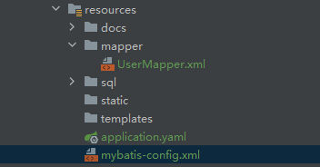

## 无法识别 Mapper.xml 文件

**(1) 应用场景**

使用 mybatis 依赖操作数据。


**(2) 问题描述**

找不到 UserMapper.xml 文件，具体报错信息如下：

```shell
Failed to create SqlSessionFactory: 
### Error building SqlSession.
### The error may exist in /mapper/UserMapper.xml
### Cause: org.apache.ibatis.builder.BuilderException: Error parsing SQL Mapper Configuration. Cause: java.io.IOException: Could not find resource /mapper/UserMapper.xml
```
文件目录结构为：


`mybatis-config.xml`  文件内容如下：

```xml
 <mappers>
      <mapper resource="/mapper/UserMapper.xml"/>
 </mappers>
```


**(3) 原因分析**

 在自动查找资源方面，Java 并没有提供一个很好的解决方案，所以最好的办法是直接告诉 MyBatis 到哪里去找映射文件。 你可以使用相对于类路径的资源引用，或完全限定资源定位符（包括 `file:///` 形式的 URL），或类名和包名等。 具体细节查看 [配置_MyBatis中文网](https://mybatis.net.cn/configuration.html#mappers)


**(4) 解决方案**

使用相对于类路径 mybatis-config.xml 的资源引用

```xml
<mappers>
     <mapper resource="./mapper/UserMapper.xml"/>
</mappers>
```


## 无法识别 entity 类

**(1) 应用场景**

使用 mybatis 依赖操作数据。


**(2) 问题描述**

找不到类 `com/zouhu/springboot/mybatis/entity/User.java`。报错内容如下：

```shell
Failed to create SqlSessionFactory: 
### Error building SqlSession.
### The error may exist in ./mapper/UserMapper.xml
### Cause: org.apache.ibatis.builder.BuilderException: Error parsing SQL Mapper Configuration. Cause: org.apache.ibatis.builder.BuilderException: Error parsing Mapper XML. The XML location is './mapper/UserMapper.xml'. Cause: org.apache.ibatis.builder.BuilderException: Error resolving class. Cause: org.apache.ibatis.type.TypeException: Could not resolve type alias 'com/zouhu/springboot/mybatis/entity/User.java'.  Cause: java.lang.ClassNotFoundException: Cannot find class: com/zouhu/springboot/mybatis/entity/User.java
```

`UserMapper` 接口内容如下：

```xml
<?xml version="1.0" encoding="UTF-8"?>
<!DOCTYPE mapper PUBLIC "-//mybatis.org//DTD Mapper 3.0//EN" "http://mybatis.org/dtd/mybatis-3-mapper.dtd">
<mapper namespace="com/zouhu/springboot/mybatis/mapper/UserMapper.java">
    <select id="selectAll" resultType="com/zouhu/springboot/mybatis/entity/User.java">
        select * from user
    </select>
</mapper>
```


**(3) 原因分析**

`resultType`  属性期望从这条语句中返回结果的类全限定名或别名。具体细节查看 [XML 映射器_MyBatis中文网](https://mybatis.net.cn/sqlmap-xml.html)

- `com/zouhu/springboot/mybatis/entity/User.java`： 使用斜杠 / 分隔包路径，并包含了.java文件扩展名。这通常不是用来引用Java类的方式，而是可能指定了文件系统路径。
- `mapper.com.zouhu.mybatis.client.UserMapper`： 使用点 . 分隔包路径，并不包含文件扩展名。这是标准的Java类引用方式。


**(4) 解决方案**

将 `resultType` 的值修改成 `entity.com.zouhu.mybatis.client.User` 这种类型的形式

```
<?xml version="1.0" encoding="UTF-8"?>
<!DOCTYPE mapper PUBLIC "-//mybatis.org//DTD Mapper 3.0//EN" "http://mybatis.org/dtd/mybatis-3-mapper.dtd">
<mapper namespace="mapper.com.zouhu.mybatis.client.UserMapper">
    <select id="selectAll" resultType="entity.com.zouhu.mybatis.client.User">
        select * from user
    </select>
</mapper>
```
