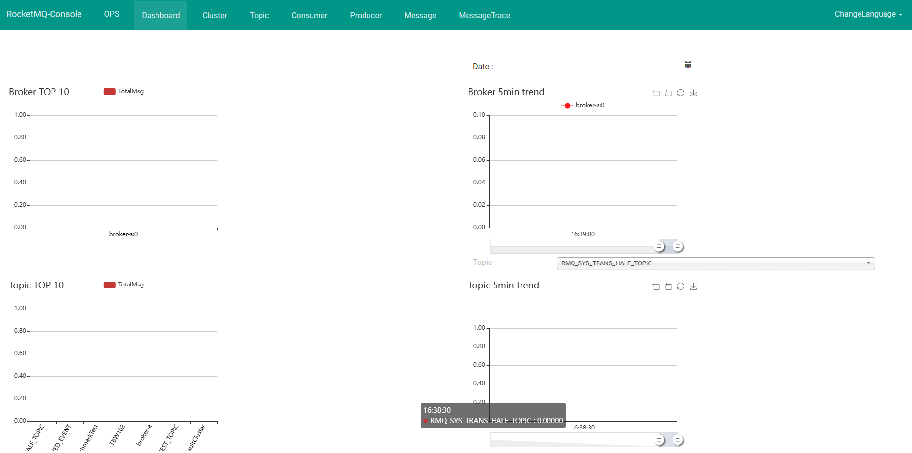

## 一、RocketMQ 部署

### 1.1 创建容器共享网络
RocketMQ 中有多个服务，需要创建多个容器，创建 docker 网络便于容器间相互通信。

```bash
$ docker network create rocketmq
```


### 1.2 启动 NameServer 

在 Docker 容器中运行 RocketMQ 的 NameServer 服务：

```shell
# 拉取RocketMQ镜像
$ docker pull apache/rocketmq:5.3.0

# 启动 NameServer
$ docker run -d ^
-p 9876:9876  ^
--name rmqnamesrv ^
--network rocketmq ^
apache/rocketmq:5.3.0 sh mqnamesrv

# 验证 NameServer 是否启动成功
$ docker logs -f rmqnamesrv
```

参数含义具体解释：

| 参数                             | 说明                                                         |
| -------------------------------- | ------------------------------------------------------------ |
| `docker run`                     | Docker 命令，用于创建并运行容器。                            |
| `-d`                             | `docker run` 命令的选项，表示以后台模式运行容器，即在后台运行容器并且不阻塞当前命令行。 |
| `-p 9876:9876`                   | `docker run` 命令的选项，用于指定容器端口映射。将主机的 9876 端口映射到容器的 9876 端口。 |
| `--name rmqnamesrv`              | `docker run` 命令的选项，用于为容器指定一个名称，这里将容器命名为 `rmqnamesrv`。 |
| `foxiswho/rocketmq:server-4.5.1` | 指定要运行的 Docker 镜像的名称和标签。`foxiswho/rocketmq` 是镜像的名称，`server-4.5.1` 是镜像的标签，表示使用的是 RocketMQ 的 Server 版本 4.5.1。 |


### 1.2 Broker 部署

Brocker 部署相对麻烦一点，主要是在系统里面创建一个配置文件。然后，通过 docker 的 -v 参数使用 volume 功能，将本地配置文件映射到容器内的配置文件上。否则所有数据都默认保存在容器运行时的内存中，重启之后就又回到最初的起点。

(1) 新建配置文件 broker.conf

创建配置文件 broker.conf， 放到指定的目录 `D:\docker\software\rocketmq\conf` 下

```
brokerClusterName = DefaultCluster
brokerName = broker-a
brokerId = 0
deleteWhen = 04
fileReservedTime = 48
brokerRole = ASYNC_MASTER
flushDiskType = ASYNC_FLUSH
brokerIP1 = 127.0.0.1 # 此处为本地ip, 如果部署服务器, 需要填写服务器外网ip
```

这里有一个问题，为什么不能使用 nameserver 直接获取 brokerIP1 的地址？

`brokerIP1` 和 `brokerIP2` 用于指定 Broker 对外提供服务的 IP 地址。如果未配置这些地址，Broker 将自动根据其网络环境选择一个可用的 IP 地址。这个默认行为在单网卡环境下通常是没有问题的，但在多网卡或 Docker 环境中就可能导致问题。Docker 容器通常会被分配一个独立的 IP 地址，可能在 Docker 的网络中不可见或无法被外部访问。如果 Broker 没有正确配置 `brokerIP1`，则外部系统可能无法与 Broker 建立连接，导致连接失败。


(2) 启动容器

```sh
# 启动 Broker 和 Proxy
$ docker run -d ^
--name rmqbroker ^
--network rocketmq ^
-p 10912:10912 -p 10911:10911 -p 10909:10909 ^
-p 8080:8080 -p 8081:8081 ^
-e "NAMESRV_ADDR=rmqnamesrv:9876" ^
-e "JAVA_OPTS=-Duser.home=/opt" ^
-e "JAVA_OPT_EXT=-server -Xms512m -Xmx512m" ^
-v D:\Learning\java-demos\middleware-demos\spring-boot-rocketmq-starter\src\main\resources\conf\broker.conf:/home/rocketmq/rocketmq-5.3.0/conf/broker.conf ^
apache/rocketmq:5.3.0 sh mqbroker --enable-proxy ^
-c /home/rocketmq/rocketmq-5.3.0/conf/broker.conf

# 验证 Broker 是否启动成功
$ docker exec -it rmqbroker bash -c "tail -n 10 /home/rocketmq/logs/rocketmqlogs/proxy.log"
```

参数含义解释:

| 参数                                                         | 说明                                                         |
| ------------------------------------------------------------ | ------------------------------------------------------------ |
| `docker run -d`                                              | 在后台运行容器                                               |
| `-p 10911:10911 -p 10909:10909`                              | 将宿主机的 10911 端口映射到容器内的 10911 端口，以及宿主机的 10909 端口映射到容器内的 10909 端口 |
| `--name rmqbroker`                                           | 将容器命名为 `rmqbroker`                                     |
| `--link rmqnamesrv:namesrv`                                  | 将名为 `rmqnamesrv` 的容器链接到该容器，并在容器内部将其命名为 `namesrv` |
| `-v ${HOME}/docker/software/rocketmq/ conf/broker.conf:/etc/rocketmq/broker.conf` | 将宿主机中指定路径下的 `broker.conf` 文件挂载到容器内的 `/etc/rocketmq/broker.conf`，这样容器内的配置文件将会被宿主机上的文件所替换 |
| `-e "NAMESRV_ADDR=namesrv:9876"`                             | 设置环境变量 `NAMESRV_ADDR` 为 `namesrv:9876`，用于连接 RocketMQ 的 NameServer |
| `-e "JAVA_OPTS=-Duser.home=/opt"`                            | 设置 Java 运行时的选项，这里指定了 Java 的用户目录为 `/opt`  |
| `-e "JAVA_OPT_EXT=-server -Xms512m -Xmx512m"`                | 设置 Java 的额外选项，包括服务器模式以及初始堆大小和最大堆大小 |
| `foxiswho/rocketmq:broker-4.5.1`                             | 指定要运行的容器镜像的名称和标签                             |


## 二、控制台部署

### 2.1 部署 rocketmq-console-ng

（1）首先，从 Docker Hub 下载 `pangliang/rocketmq-console-ng` 仓库中的镜像：

```shell
docker pull pangliang/rocketmq-console-ng
```

（2）然后，在 Docker 容器中运行 RocketMQ 的 NameServer 服务：

```sh
# Windows 系统 （cmd里面运行，Windows PowerShell里面运行不了）
docker run -d ^
--link rmqnamesrv:namesrv ^
-e "JAVA_OPTS=-Drocketmq.config.namesrvAddr=namesrv:9876 -Drocketmq.config.isVIPChannel=false" ^
--name rmqconsole-test ^
-p 8088:8080 ^
-t pangliang/rocketmq-console-ng
```


| 参数                                                         | 说明                                                         |
| ------------------------------------------------------------ | ------------------------------------------------------------ |
| `docker run -d`                                              | 在后台运行容器                                               |
| `--link rmqnamesrv:namesrv`                                  | 将名为 `rmqnamesrv` 的容器链接到该容器，并在容器内部将其命名为 `namesrv` |
| `-e "JAVA_OPTS=-Drocketmq.config.namesrvAddr=namesrv:9876 -Drocketmq.config.isVIPChannel=false"` | 设置环境变量 `JAVA_OPTS`，指定 RocketMQ 控制台运行时的 Java 配置选项，包括指定 NameServer 的地址和禁用 VIP 通道 |
| `--name rmqconsole`                                          | 将容器命名为 `rmqconsole`                                    |
| `-p 8088:8080`                                               | 将宿主机的 8088 端口映射到容器内的 8080 端口，以便通过宿主机的 8088 端口访问 RocketMQ 控制台 |
| `-t pangliang/rocketmq-console-ng`                           | 指定要运行的容器镜像的名称和标签                             |


### 2.2 运行

运行成功，稍等几秒启动时间，浏览器输入 http://localhost:8088 查看。




## 三、使用案例

### 3.1 导入依赖

```xml
<dependency>
    <groupId>org.apache.rocketmq</groupId>
    <artifactId>rocketmq-spring-boot-starter</artifactId>
    <version>2.3.0</version>
</dependency>
```


### 3.2 创建 Topic

```bash
$ docker exec -it rmqbroker bash

$ sh mqadmin updatetopic -t test-topic-1 -c DefaultCluster -a +message.type=NORMAL
```


### 3.3 生产者

```java
@Component
@RequiredArgsConstructor
public class RocketMQProducer {

    private final RocketMQTemplate rocketMQTemplate;

    /**
     * 展示四种发送方式
     * <p>
     *     1. send message synchronously.    同步发送消息
     *     2. send spring message.           构建spring message后发送消息
     *     3. send message asynchronously.   异步发送消息
     *     4. Send messages orderly.         顺序发送消息
     * </p>
     *
     * @param topic
     * @param message
     */
    public void sendMessage(String topic, String message) {
        // 1. send message synchronously
        rocketMQTemplate.convertAndSend(topic, message);
        // rocketMQTemplate.convertAndSend(topic, new OrderPaidEvent("T_001", new BigDecimal("88.00")));

        // 2. send spring message
        // Message<String> rocketMessage = MessageBuilder.withPayload(message).build();
        // rocketMQTemplate.send(topic, rocketMessage);

        // 3. send message asynchronously
        // rocketMQTemplate.asyncSend(topic, new OrderPaidEvent("T_001", new BigDecimal("88.00")), new SendCallback() {
        //     // 发送成功
        //     @Override
        //     public void onSuccess(SendResult var1) {
        //         System.out.printf("async onSucess SendResult=%s %n", var1);
        //     }
        //
        //     // 发送失败
        //     @Override
        //     public void onException(Throwable var1) {
        //         System.out.printf("async onException Throwable=%s %n", var1);
        //     }
        //
        // });

        // 4. Send messages orderly
        // Message<String> rocketMessage = MessageBuilder.withPayload(message).build();
        // rocketMQTemplate.syncSendOrderly(topic, rocketMessage,"hashkey");

        System.out.println("Message sent: " + message);
    }

    @Data
    @AllArgsConstructor
    public class OrderPaidEvent implements Serializable {
        private String orderId;

        private BigDecimal paidMoney;
    }
}
```


### 3.4 消费者

```java
@Component
@RocketMQMessageListener(
        topic = "test-topic-1",
        consumerGroup = "my-consumer_test-topic-1"
)
public class RocketMQConsumer implements RocketMQListener<String> {

    @Override
    public void onMessage(String message) {
        System.out.println("Received message: " + message);
    }
}
```


## 参考资料

[Docker 部署 RocketMQ | RocketMQ (apache.org)](https://rocketmq.apache.org/zh/docs/quickStart/02quickstartWithDocker#4启动-brokerproxy)

[window 环境下docker 安装 rocketMQ_windows docker rocketmq-CSDN博客](https://blog.csdn.net/keep_learn/article/details/120540295)