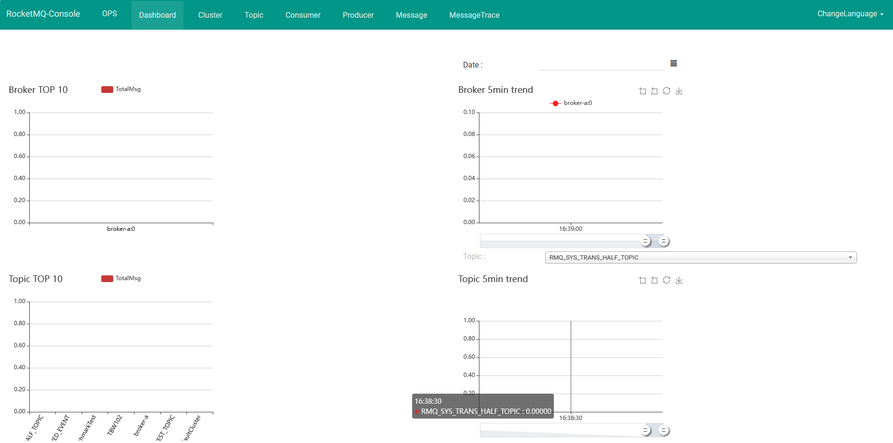

# 一、RocketMQ 部署

RocketMQ 4.5.1 镜像仓库：[foxiswho/rocketmq - Docker Image | Docker Hub](https://hub.docker.com/r/foxiswho/rocketmq)  


## 1.1 NameServer 部署

首先，从 Docker Hub 下载 `foxiswho/rocketmq` 仓库中带有 `server-4.5.1` 标签的镜像：

```
docker pull foxiswho/rocketmq:server-4.5.1 
```

然后，在 Docker 容器中运行 RocketMQ 的 NameServer 服务：

```shell
docker run -d -p 9876:9876 --name rmqnamesrv-test foxiswho/rocketmq:server-4.5.1
```

参数含义具体解释：

| 参数                             | 说明                                                         |
| -------------------------------- | ------------------------------------------------------------ |
| `docker run`                     | Docker 命令，用于创建并运行容器。                            |
| `-d`                             | `docker run` 命令的选项，表示以后台模式运行容器，即在后台运行容器并且不阻塞当前命令行。 |
| `-p 9876:9876`                   | `docker run` 命令的选项，用于指定容器端口映射。将主机的 9876 端口映射到容器的 9876 端口。 |
| `--name rmqnamesrv`              | `docker run` 命令的选项，用于为容器指定一个名称，这里将容器命名为 `rmqnamesrv`。 |
| `foxiswho/rocketmq:server-4.5.1` | 指定要运行的 Docker 镜像的名称和标签。`foxiswho/rocketmq` 是镜像的名称，`server-4.5.1` 是镜像的标签，表示使用的是 RocketMQ 的 Server 版本 4.5.1。 |


## 1.2 Broker 部署

```
 docker pull foxiswho/rocketmq:broker-4.5.1
```

Brocker 部署相对麻烦一点，主要是在系统里面创建一个配置文件。然后，通过 docker 的 -v 参数使用 volume 功能，将本地配置文件映射到容器内的配置文件上。否则所有数据都默认保存在容器运行时的内存中，重启之后就又回到最初的起点。

1）新建配置目录

Windows 系统

```
mkdir -p D:\docker\software\rocketmq\conf
```

Linux 系统：

```
mkdir -p ${HOME}/docker/software/rocketmq/conf
```


2）新建配置文件 broker.conf

```
brokerClusterName = DefaultCluster
brokerName = broker-a
brokerId = 0
deleteWhen = 04
fileReservedTime = 48
brokerRole = ASYNC_MASTER
flushDiskType = ASYNC_FLUSH
brokerIP1 = 127.0.0.1 # 此处为本地ip, 如果部署服务器, 需要填写服务器外网ip
```


3) 创建容器

```sh
# Linux 系统
docker run -d \
-p 10911:10911 \
-p 10909:10909 \
--name rmqbroker \
--link rmqnamesrv:namesrv \
-v ${HOME}/docker/software/rocketmq/conf/broker.conf:/etc/rocketmq/broker.conf \
-e "NAMESRV_ADDR=namesrv:9876" \
-e "JAVA_OPTS=-Duser.home=/opt" \
-e "JAVA_OPT_EXT=-server -Xms512m -Xmx512m" \
foxiswho/rocketmq:broker-4.5.1

# Windows 系统 （cmd里面运行，Windows PowerShell里面运行不了）
docker run -d ^
-p 10911:10911 ^
-p 10909:10909 ^
--name rmqbroker-test ^
--link rmqnamesrv-test:namesrv ^
-v C:\Users\zouhu\Desktop\java-demos\spring-boot-rocketmq-starter\src\main\resources\conf\broker.conf:/etc/rocketmq/broker.conf ^
-e "NAMESRV_ADDR=namesrv:9876" ^
-e "JAVA_OPTS=-Duser.home=/opt" ^
-e "JAVA_OPT_EXT=-server -Xms512m -Xmx512m" ^
foxiswho/rocketmq:broker-4.5.1
```


参数含义解释

| 参数                                                         | 说明                                                         |
| ------------------------------------------------------------ | ------------------------------------------------------------ |
| `docker run -d`                                              | 在后台运行容器                                               |
| `-p 10911:10911 -p 10909:10909`                              | 将宿主机的 10911 端口映射到容器内的 10911 端口，以及宿主机的 10909 端口映射到容器内的 10909 端口 |
| `--name rmqbroker`                                           | 将容器命名为 `rmqbroker`                                     |
| `--link rmqnamesrv:namesrv`                                  | 将名为 `rmqnamesrv` 的容器链接到该容器，并在容器内部将其命名为 `namesrv` |
| `-v ${HOME}/docker/software/rocketmq/ conf/broker.conf:/etc/rocketmq/broker.conf` | 将宿主机中指定路径下的 `broker.conf` 文件挂载到容器内的 `/etc/rocketmq/broker.conf`，这样容器内的配置文件将会被宿主机上的文件所替换 |
| `-e "NAMESRV_ADDR=namesrv:9876"`                             | 设置环境变量 `NAMESRV_ADDR` 为 `namesrv:9876`，用于连接 RocketMQ 的 NameServer |
| `-e "JAVA_OPTS=-Duser.home=/opt"`                            | 设置 Java 运行时的选项，这里指定了 Java 的用户目录为 `/opt`  |
| `-e "JAVA_OPT_EXT=-server -Xms512m -Xmx512m"`                | 设置 Java 的额外选项，包括服务器模式以及初始堆大小和最大堆大小 |
| `foxiswho/rocketmq:broker-4.5.1`                             | 指定要运行的容器镜像的名称和标签                             |


# 二、控制台部署

## 2.1 部署 rocketmq-console-ng

（1）首先，从 Docker Hub 下载 `pangliang/rocketmq-console-ng` 仓库中的镜像：

```shell
docker pull pangliang/rocketmq-console-ng
```

（2）然后，在 Docker 容器中运行 RocketMQ 的 NameServer 服务：

```sh
# Linux 系统
docker run -d \
--link rmqnamesrv:namesrv \
-e "JAVA_OPTS=-Drocketmq.config.namesrvAddr=namesrv:9876 -Drocketmq.config.isVIPChannel=false" \
--name rmqconsole \
-p 8088:8080 \
-t pangliang/rocketmq-console-ng

# Windows 系统 （cmd里面运行，Windows PowerShell里面运行不了）
docker run -d ^
--link rmqnamesrv-test:namesrv ^
-e "JAVA_OPTS=-Drocketmq.config.namesrvAddr=namesrv:9876 -Drocketmq.config.isVIPChannel=false" ^
--name rmqconsole-test ^
-p 8088:8080 ^
-t pangliang/rocketmq-console-ng
```


| 参数                                                         | 说明                                                         |
| ------------------------------------------------------------ | ------------------------------------------------------------ |
| `docker run -d`                                              | 在后台运行容器                                               |
| `--link rmqnamesrv:namesrv`                                  | 将名为 `rmqnamesrv` 的容器链接到该容器，并在容器内部将其命名为 `namesrv` |
| `-e "JAVA_OPTS=-Drocketmq.config.namesrvAddr=namesrv:9876 -Drocketmq.config.isVIPChannel=false"` | 设置环境变量 `JAVA_OPTS`，指定 RocketMQ 控制台运行时的 Java 配置选项，包括指定 NameServer 的地址和禁用 VIP 通道 |
| `--name rmqconsole`                                          | 将容器命名为 `rmqconsole`                                    |
| `-p 8088:8080`                                               | 将宿主机的 8088 端口映射到容器内的 8080 端口，以便通过宿主机的 8088 端口访问 RocketMQ 控制台 |
| `-t pangliang/rocketmq-console-ng`                           | 指定要运行的容器镜像的名称和标签                             |


## 2.2 运行

运行成功，稍等几秒启动时间，浏览器输入 http://localhost:8088 查看。




# 参考资料

[Docker 部署 RocketMQ | RocketMQ (apache.org)](https://rocketmq.apache.org/zh/docs/quickStart/02quickstartWithDocker#4启动-brokerproxy)

[window 环境下docker 安装 rocketMQ_windows docker rocketmq-CSDN博客](https://blog.csdn.net/keep_learn/article/details/120540295)