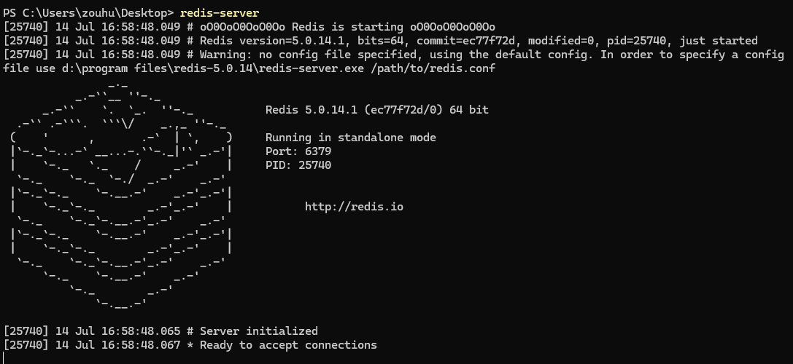
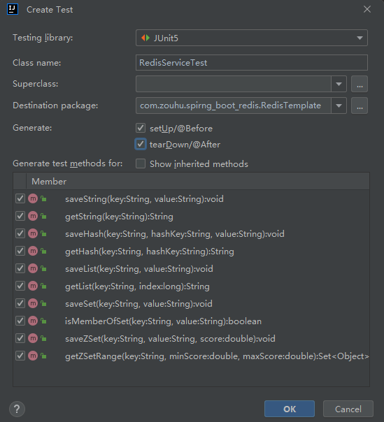

###  0.启动 Redis服务器

打开 cmd ， 输入 `redis-server` ，启动 Redis 服务器。




### 1. 添加依赖

首先，在 `pom.xml` 中添加 Spring Data Redis 的依赖：

```xml
<dependency>
    <groupId>org.springframework.boot</groupId>
    <artifactId>spring-boot-starter-data-redis</artifactId>
</dependency>
```


### 2.配置 Redis 相关信息

在 `application.yml` 里面，配置相关信息：

```yaml
spring:
  redis:
    host: localhost
    port: 6379
    password: yourpassword # 如果没有密码，可以去掉这一行
    database: 0
    lettuce:
      pool:
        max-active: 8
        max-idle: 8
        min-idle: 0
        max-wait: -1ms
```

注意，当你使用 Spring Boot 和 Spring Data Redis 时，**Spring Boot 会自动配置一些默认的 Redis 设置**，如果你没有在 `application.yml` 或 `application.properties` 文件中指定 `spring.redis.host` 和 `spring.redis.port`，Spring Boot 会使用以下默认值：

- `host`：`localhost`
- `port`：`6379`

这意味着，如果你的 Redis 服务器运行在本地并且使用默认端口（6379），即使你没有明确配置这些属性，应用程序仍然能够连接到 Redis 服务器。


### 3. 创建配置类 RedisTemplate

在 Spring Boot 应用中，可以通过配置类来配置 `RedisTemplate`。

```java
import org.springframework.context.annotation.Bean;
import org.springframework.context.annotation.Configuration;
import org.springframework.data.redis.connection.RedisConnectionFactory;
import org.springframework.data.redis.core.RedisTemplate;
import org.springframework.data.redis.serializer.StringRedisSerializer;

@Configuration
public class RedisConfig {

    @Bean
    public RedisTemplate<String, Object> redisTemplate(RedisConnectionFactory connectionFactory) {
        RedisTemplate<String, Object> template = new RedisTemplate<>();
        template.setConnectionFactory(connectionFactory);
        
        // 设置 key 序列化器
        template.setKeySerializer(new StringRedisSerializer());
        
        // 设置 value 序列化器，可以根据需要选择不同的序列化器
        template.setValueSerializer(new StringRedisSerializer());

        // 其他序列化配置
        template.setHashKeySerializer(new StringRedisSerializer());
        template.setHashValueSerializer(new StringRedisSerializer());
        
        template.afterPropertiesSet();
        return template;
    }
}
```


### 4. 使用 RedisTemplate

在服务类中注入并使用 `RedisTemplate` 进行各种操作。

```java
import org.springframework.beans.factory.annotation.Autowired;
import org.springframework.data.redis.core.RedisTemplate;
import org.springframework.data.redis.core.StringRedisTemplate;
import org.springframework.stereotype.Service;

import java.util.Set;

@Service
public class RedisService {

    @Autowired
    private RedisTemplate<String, Object> redisTemplate;

    @Autowired
    private StringRedisTemplate stringRedisTemplate;

    // 存储字符串
    public void saveString(String key, String value) {
        redisTemplate.opsForValue().set(key, value);
    }

    // 获取字符串
    public String getString(String key) {
        return (String) redisTemplate.opsForValue().get(key);
    }

    // 存储哈希
    public void saveHash(String key, String hashKey, String value) {
        redisTemplate.opsForHash().put(key, hashKey, value);
    }

    // 获取哈希
    public String getHash(String key, String hashKey) {
        return (String) redisTemplate.opsForHash().get(key, hashKey);
    }

    // 存储列表
    public void saveList(String key, String value) {
        redisTemplate.opsForList().rightPush(key, value);
    }

    // 获取列表
    public String getList(String key, long index) {
        return (String) redisTemplate.opsForList().index(key, index);
    }

    // 存储集合
    public void saveSet(String key, String value) {
        stringRedisTemplate.opsForSet().add(key, value);
    }

    // 获取集合
    public Set<String> getSet(String key) {
        return stringRedisTemplate.opsForSet().members(key);
    }

    // 存储有序集合
    public void saveZSet(String key, String value, double score) {
        redisTemplate.opsForZSet().add(key, value, score);
    }

    // 获取有序集合
    public Set<Object> getZSetRange(String key, double minScore, double maxScore) {
        return redisTemplate.opsForZSet().rangeByScore(key, minScore, maxScore);
    }
}
```


### 5. 测试

首先利用 idea 的功能快速创建测试类 `RedisServiceTest` 。



在测试类中，使用 `@SpringBootTest` 注解启动 Spring 应用上下文，并使用 `@Autowired` 注入 `RedisTemplate` 或服务类。你可以使用 `@BeforeEach` 和 `@AfterEach` 方法分别在每个测试方法之前和之后进行初始化和清理工作。

```java

import org.junit.jupiter.api.AfterEach;
import org.junit.jupiter.api.BeforeEach;
import org.junit.jupiter.api.Test;
import org.springframework.beans.factory.annotation.Autowired;
import org.springframework.boot.test.context.SpringBootTest;
import org.springframework.data.redis.core.RedisTemplate;

import java.util.Set;

import static org.junit.jupiter.api.Assertions.*;

@SpringBootTest
class RedisServiceTest {
    @Autowired
    private RedisTemplate<String, Object> redisTemplate;

    @Autowired
    private RedisService redisService;

    @BeforeEach
    void setUp() {
        // 清理 Redis 中的所有数据
        redisTemplate.getConnectionFactory().getConnection().flushDb();
    }

    @AfterEach
    void tearDown() {
        // 清理 Redis 中的所有数据
        redisTemplate.getConnectionFactory().getConnection().flushDb();
    }

    @Test
    void saveString() {
        redisService.saveString("testKey", "testValue");
        String value = redisService.getString("testKey");
        System.out.println("testKey :" + value);
        assertEquals("testValue", value);
    }

    @Test
    void saveHash() {
        redisService.saveHash("testHash", "hashKey", "hashValue");
        String value = redisService.getHash("testHash", "hashKey");
        assertEquals("hashValue", value);
    }


    @Test
    void saveList() {
        redisService.saveList("testList", "listValue");
        String value = redisService.getList("testList", 0);
        assertEquals("listValue", value);
    }

    @Test
    void saveSet() {
//        redisService.saveSet("testSet", "setValue");
//        boolean isMember = redisService.isMemberOfSet("testSet", "setValue");
//        assertTrue(isMember);

        redisService.saveSet("testSet", "value1");
        redisService.saveSet("testSet", "value2");
        redisService.saveSet("testSet", "value3");

        Set<String> values = redisService.getSet("testSet");
        System.out.println("testSet: " + values);
        assertTrue(values.contains("value1"));
        assertTrue(values.contains("value2"));
        assertTrue(values.contains("value3"));
    }


    @Test
    void saveZSet() {
        redisService.saveZSet("testZSet", "zsetValue", 1.0);
        Set<Object> values = redisService.getZSetRange("testZSet", 0, 2);
        assertTrue(values.contains("zsetValue"));
    }

}
```