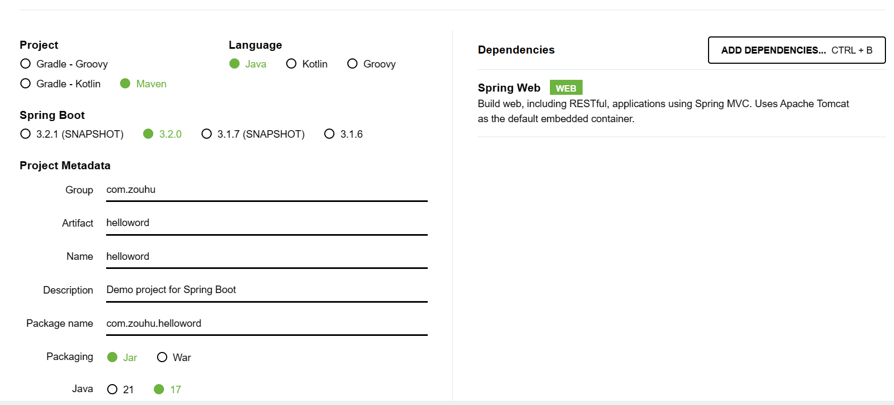
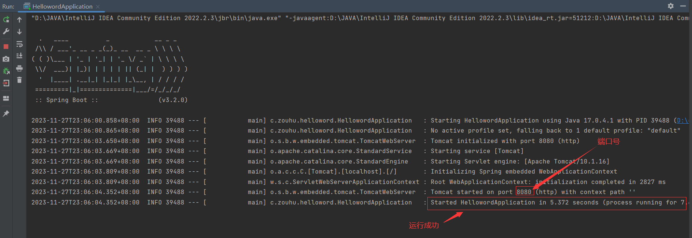
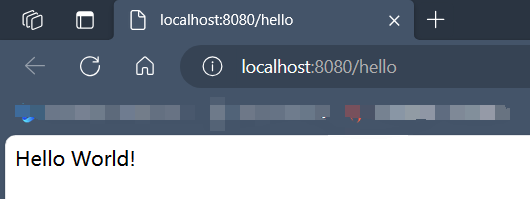

[TOC]


# 项目创建步骤
> 本文档实现SpringBoot  hello word 程序，翻译于[Spring | Quickstart](https://spring.io/quickstart)/
>
> 项目代码地址为：
## 1.1 创建项目

在官网[Spring Initializr](https://start.spring.io/)上创建项目




其中，通常会涉及到以下几个重要的项目信息：

1. **Group（组织或者公司的唯一标识）：** 在Maven或Gradle项目中，Group通常用于唯一标识组织或公司的项目，通常使用逆域名（反向域名）的形式，例如：`com.example`。
2. **Artifact（项目唯一标识）：** Artifact是项目在Group中的唯一标识符，通常表示项目的名称或者模块名称，例如：`my-project`。**不能有大写，都是小写，不同单词之间用 “-” 隔开**。
3. **Name（项目显示名称）：** 声明了一个对于用户更为友好的项目名称（默认等同`Artifact`），不是必须的。推荐为每个pom声明name，以方便信息交流。。 例如：`My Project`。
4. **Package name（包名）：** Package name是Java包的命名，用于组织和管理项目中的类和文件，通常是根据Group和Artifact来构建的。**Package name 应该全部使用小写字母，将连字符 `-` 替换为点 `.` **。 例如：`com.example.myproject`。

```
<groupId>com.zouhu</groupId>
<artifactId>helloword</artifactId>
<version>0.0.1-SNAPSHOT</version>
<name>helloword</name>
<description>Demo project for Spring Boot</description>
```

`Grounp+Artifact`就相当于**项目的坐标**，保证了项目的唯一性。如果你要把你项目弄到maven本地仓库去，想要找到你的项目就必须根据这两个id去查找。


## 1.2 添加代码

在IDE中打开项目并在`src/main/java/com/zouhu/helloword`文件夹中找到`HellowordApplication.java`文件，现在通过添加下面代码中显示的额外方法和注释来更改文件的内容。

```
package com.example.demo;
import org.springframework.boot.SpringApplication;
import org.springframework.boot.autoconfigure.SpringBootApplication;
import org.springframework.web.bind.annotation.GetMapping;
import org.springframework.web.bind.annotation.RequestParam;
import org.springframework.web.bind.annotation.RestController;

@SpringBootApplication
@RestController
public class DemoApplication {
    public static void main(String[] args) {
      SpringApplication.run(DemoApplication.class, args);
    }
    @GetMapping("/hello")
    public String hello(@RequestParam(value = "name", defaultValue = "World") String name) {
      return String.format("Hello %s!", name);
    }
}
```

hello（）方法被设计为采用一个名为name的String参数，然后将该参数与代码中的单词“Hello”结合起来。这意味着如果您在请求中将姓名设置为“Amy”，则响应将是“Hello Amy”。

@RestController注释告诉Spring，这段代码描述了一个应该在Web上可用的端点。

@GetMap（"/hello"）告诉Spring使用我们的hello（）方法来回答发送到http://localhost:8080/hello地址的请求。

最后，@RequestParam告诉Spring期望请求中有一个名称值，但如果不存在，它将默认使用单词“World”


## 1.3 运行

编译并运行程序。

根据启动界面可以看到以下信息：Spring Boot的嵌入式Apache Tomcat服务器充当网络服务器，并在localhost端口8080上侦听请求。




打开浏览器，在顶部的地址栏中输入http://localhost:8080/hello即可访问

> 也可以通过添加参数来访问http://localhost:8080/hello?name=zouhu 




# 参考教程

[Spring | Quickstart](https://spring.io/quickstart)

