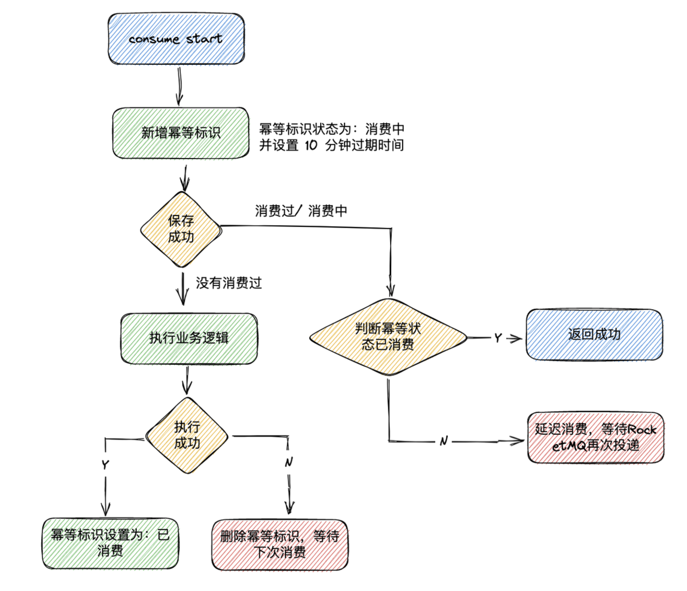

### 消费过程幂等

[rocketmq/docs/cn/best_practice.md at develop · apache/rocketmq (github.com)](https://github.com/apache/rocketmq/blob/develop/docs/cn/best_practice.md)

RocketMQ无法避免消息重复（Exactly-Once），所以如果业务对消费重复非常敏感，务必要在业务层面进行去重处理。可以借助关系数据库进行去重。首先需要确定消息的唯一键，可以是msgId，也可以是消息内容中的唯一标识字段，例如订单Id等。在消费之前判断唯一键是否在关系数据库中存在。如果不存在则插入，并消费，否则跳过。（实际过程要考虑原子性问题，判断是否存在可以尝试插入，如果报主键冲突，则插入失败，直接跳过）

**msgId一定是全局唯一标识符，但是实际使用中，可能会存在相同的消息有两个不同msgId的情况**（消费者主动重发、因客户端重投机制导致的重复等），这种情况就需要使业务字段进行重复消费。


### 消费幂等流程

在获取到 Redis 的 key 后，value 值有 3 种状态， 对应消费的 3 种状态：

- `value ` 为空：代表消息是第一次到达，执行完 LUA 脚本后，会在 Redis 设置 Key 的 Value 值为 0，消费中状态。
- `value ` 为 0：代表已经有相同消息到达并且还没有处理完，会通过抛异常的形式让 RocketMQ 重试。
- `value ` 为 1：代表已经有相同消息消费完成，返回空表示不执行任何处理。





具体来说，当客户端发送请求时，服务端会先查询 Redis 去重表来检查该请求是否已经被处理过。如果在存在对应的记录，表示请求已经执行过，服务端可以直接返回之，而不再执行重复操作。如果在不存在对应的记录，表示请求是新的，服务端会执行相应的业务逻辑，并在处理完成后将请求的唯一标识（如请求 ID 或标识）添加到 Redis 去重表中，以便后续的重复请求可以被正确识别和处理。

另外，如果消息已经在消费中，抛出异常，消息会触发延迟消费，在消息队列消费失败的场景下即发送到重试队列 `RETRY TOPIC`。


### Redis 脚本

```lua
local key = KEYS[1]         -- 第一个 Key，即幂等唯一标识 uniqueKey
local value = ARGV[1]       -- 第一个参数，即初始化幂等消费状态，为消费中
local expire_time_ms = ARGV[2] -- 第二个参数，即幂等 Key 过期时间

-- 以 NX(仅在键不存在时设置）方式设置 Key
local result = redis.call('SET', key, value, 'NX', 'PX', expire_time_ms)

-- 如果设置成功，result 为 "OK"，否则为 nil
if result == 'OK' then
    -- 如果设置成功，则返回 nil，
    -- 这代表消息是第一次到达
    return nil
else
    -- 如果设置失败，返回旧值
    -- 0 表示正在消费中的相同消息, 1 表示已经消费成功的相同消息
    return redis.call('GET', key)
end
```

该脚本的主要作用是：在 Redis 中尝试以 `NX` 方式设置一个键，即如果键不存在，则设置新值，并返回设置之前的旧值，同时为该键设置过期时间（以毫秒为单位）。

获取到 Redis 里面的 Key 值后，可能会有三个流程执行：

- `absentAndGet` 为空：代表消息是第一次到达，执行完 LUA 脚本后，会在 Redis 设置 Key 的 Value 值为 0，消费中状态。
- absentAndGet` 为 0：代表已经有相同消息到达并且还没有处理完，会通过抛异常的形式让 RocketMQ 重试。
- `absentAndGet` 为 1：代表已经有相同消息消费完成，返回空表示不执行任何处理。


### Redis 脚本验证

验证脚本的可行性

```lua
local key = KEYS[1]         -- 第一个 Key，即幂等唯一标识 uniqueKey
local value = ARGV[1]       -- 第一个参数，即初始化幂等消费状态，为消费中
local expire_time_ms = ARGV[2] -- 第二个参数，即幂等 Key 过期时间

-- 以 NX(仅在键不存在时设置）方式设置 Key
local result = redis.call('SET', key, value, 'NX', 'PX', expire_time_ms)

-- 如果设置成功，result 为 "OK"，否则为 nil
if result == 'OK' then
    -- 如果设置成功，则返回 nil，
    -- 这代表消息是第一次到达
    return nil
else
    -- 如果设置失败，返回旧值
    -- 0 表示正在消费中的相同消息, 1 表示已经消费成功的相同消息
    return redis.call('GET', key)
end

```


进入 redis-cli 

```
EVAL "local key = KEYS[1]; local value = ARGV[1]; local expire_time_ms = ARGV[2]; return redis.call('SET', key, value, 'NX', 'GET', 'PX', expire_time_ms)" 1 testKey testValue 60000


GET testKey
```


```bash
$ GET test

$ DEL test

$  EVAL "local key = KEYS[1]; local value = ARGV[1]; local expire_time_ms = ARGV[2]; local result = redis.call('SET', key, value, 'NX', 'PX', expire_time_ms); return result" 1 test testValue 60000
OK
```


这个脚本存在问题

```bash
$ GET test

$ DEL test

$ EVAL "local key = KEYS[1]; local value = ARGV[1]; local expire_time_ms = ARGV[2]; local result = redis.call('SET', key, value, 'NX', 'PX', expire_time_ms); if result == 'OK' then return 'ok1' else return 'ok2' end" 1 test testValue 60000
"ok2"

```


```
$ GET test

$ DEL test

$ EVAL "local key = KEYS[1]; local value = ARGV[1]; local expire_time_ms = ARGV[2]; local result = redis.call('SET', key, value, 'NX', 'PX', expire_time_ms); if result == 'OK' then return 'ok1' else return 'ok2' end" 1 test testValue 60000
"ok2"
```


```bash
$ GET test

$ DEL test

$ EVAL "local key = KEYS[1]; local value = ARGV[1]; local expire_time_ms = ARGV[2]; if redis.call('SET', key, value, 'NX', 'PX', expire_time_ms) then return 'ok1' else return 'ok2' end" 1 test testValue 60000
"ok1"

$ EVAL "local key = KEYS[1]; local value = ARGV[1]; local expire_time_ms = ARGV[2]; if redis.call('SET', key, value, 'NX', 'PX', expire_time_ms) then return 'ok1' else return 'ok2' end" 1 test testValue 60000
"ok2"

```


### 测试

在切面类 `ConsumeIdempotentAspect` 中打断点， 在真正执行前， 手动设置 redis 的值， 故意设置成该消息处于消费状态。

