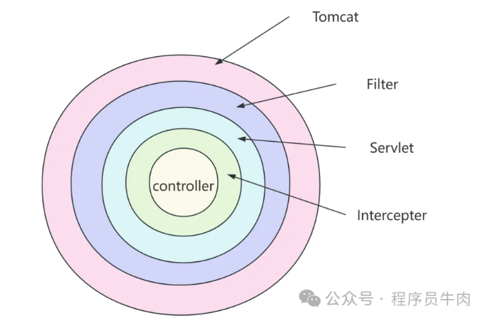

### 过滤器和拦截器的区别

最关键的区别在于过滤器基于 Java Servlet 规范实现，而拦截器基于 Spring 框架实现。

因此，拦截器可以 Spring Bean 提供的功能，适合依赖 Spring MVC 上下文的全局请求处理。

| **特性**                 | **过滤器 (Filter)**                                          | **拦截器 (Interceptor)**                                     |
| ------------------------ | ------------------------------------------------------------ | ------------------------------------------------------------ |
| **定义**                 | 过滤器是 Servlet 规范的一部分，处理请求和响应。              | 拦截器是 Spring 提供的，它主要用于处理控制器方法的调用。     |
| **生命周期**             | 在 Servlet 容器中创建，处理请求和响应。                      | 在 Spring 容器中创建，处理方法调用前后。                     |
| **配置方式**             | 通过 `@WebFilter` 注解或 `FilterRegistrationBean` 注册。     | 通过 `@Interceptor` 注解或实现 `HandlerInterceptor` 接口。   |
| **拦截范围**             | 在请求进入后、离开前调用，可以在请求进入控制器之前进行预处理，也可以在响应发送给客户端之前进行后处理。                        | 在请求处理的不同阶段调用，包括preHandle（请求处理前）、postHandle（请求处理后、视图渲染前）和afterCompletion（请求完成后）  |
| **是否可以直接修改请求** | 可以修改请求和响应的内容，或终止请求链。                     | 无法修改请求和响应内容，主要用于拦截并判断逻辑。             |
| **执行顺序**             | 过滤器在 DispatcherServlet 前执行，顺序由配置决定。          | 拦截器在控制器方法执行之前或之后执行。                       |
| **注册方式**             | 使用 `FilterRegistrationBean` 或 `@WebFilter` 注解。         | 使用 `@Configuration` 中的 `addInterceptors()` 方法注册。    |
| **事务支持**             | 不支持事务管理。                                             | 支持事务管理（通常与 Spring AOP 配合使用）。                 |

### 作用范围

### 参考资料

[腾讯面试：过滤器和拦截器的区别是什么？答不上来，如鲠在喉？看看这篇吧](https://mp.weixin.qq.com/s/Ng-bc_egeFa24TDEz2W85A)