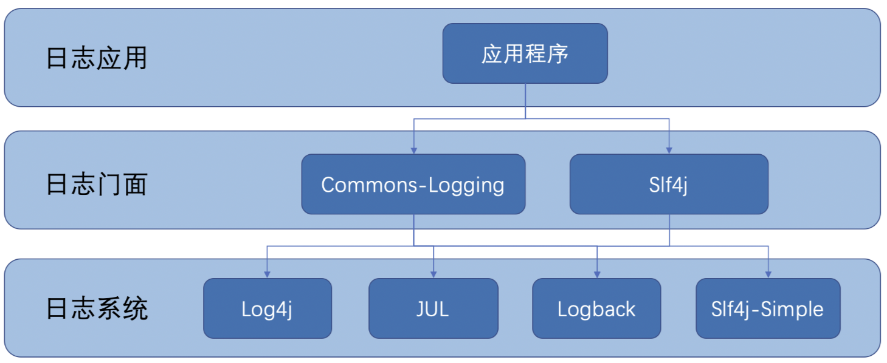

## 一、日志概述

### 1.1 为什么要引入日志

- **在开发调试阶段**: 日志系统有助于更快的定位问题。

- **在应用运维阶段**: 日志系统有助于记录大部分的异常信息，通过收集日志信息可以对系统的运行状态进行实时监控预警。

- **在数据分析阶段**: 日志中通常包含大量的用户数据，包括点击行为、兴趣偏好等，基于这些数据可以对用户进行“画像”，进而助力战略决策。随着大数据技术日渐成熟，海量日志分析已经在互联网公司得到广泛应用。

  

### 1.2 日志框架演化史

由于早期 Java 日志框架没有指定统一的标准，很多应用程序会同时使用多种日志框架。可以看出，Java 的日志框架体系比较混乱。

#### 1.2.1 System.out 和 System.err

**早期阶段**：在最初的 Java 程序中，开发者通常使用 `System.out.println()` 和 `System.err.println()` 来进行日志记录。

**缺点**：这种方法缺乏灵活性，不易管理，无法进行日志级别控制，且无法将日志输出到文件等其他介质。

#### 1.2.2 **Log4j**

- **出现时间**：1999 年。
- **特点**：由 Apache 提供的一个功能强大的日志框架，支持多种日志级别、日志格式和日志输出方式。
- **优点**：功能丰富，配置灵活，性能好。
- **缺点**：XML 配置较为复杂，无法满足所有用户的需求。

#### 1.2.2 java.util.logging (JUL)

**出现时间**：Java 1.4 引入（2002年）。

**特点**：作为 Java 标准库的一部分，提供了基础的日志记录功能。

**优点**：无需外部依赖，简单易用。

**缺点**：功能较弱，性能一般，配置不够灵活。

#### 1.2.3 Apache Commons Logging (JCL)

**出现时间**：2002。

**特点**：提供了一个通用的日志接口，可以与不同的日志实现（如 Log4j、JUL）集成。

**优点**：通过配置可以灵活地切换底层日志实现，解耦日志接口与实现。

**缺点**：存在类加载器问题，配置复杂。

#### 1.2.5 SLF4J (Simple Logging Facade for Java)

**出现时间**：2005年。

**特点**：提供一个简单的日志门面，允许开发者使用统一的 API 接口，而底层可以选择不同的日志实现（如 Log4j、Logback、JUL）。

**优点**：解耦了日志 API 和日志实现，易于切换和集成不同的日志框架。

**缺点**：需要与实际的日志实现一起使用。

#### 1.2.6 Logback

- **出现时间**：2006年，由 Log4j 的创始人 Ceki Gülcü 开发。
- **特点**：作为 SLF4J 的原生实现，提供了高性能、灵活配置和高级功能。
- **优点**：配置简单，性能优越，功能丰富（如条件日志、基于时间的日志切割等）。
- **缺点**：对新用户来说，配置和使用可能有一定的学习曲线。

## 二、日志框架

比较常用的组合使用方式是 Slf4j 与 Logback 组合使用。

### 2.1 日志门面和日志系统

日志框架主要分为日志门面和日志系统这两种类型。

- **日志门面**：提供统一的日志记录接口，独立于具体的日志实现。日志门面的主要目的是**解耦应用程序与具体的日志实现**，从而使得更换日志实现变得简单和透明。

- **日志系统**：具体的日志记录实现，负责实际的日志记录工作，包括日志的格式化、级别控制、输出方式等。日志系统提供了日志记录的具体功能。

其中，日志门面是通过软件设计模式中的**门面模式**来实现的。

### 2.2 为什么采用门面模式

采用日志门面模式将日志功能划分为日志门面和日志系统，可以实现应用程序与具体日志实现的解耦，提高灵活性和可维护性，提供标准化接口，便于测试和统一管理日志记录，解决依赖冲突问题。

其中，**最重要的是解决了依赖冲突问题**。在大型项目中，可能会使用多个第三方库，这些库可能依赖不同的日志系统。在上述场景中，我们的系统需要同时支持并维护 Logback、Log4j、JUL 三种日志框架，其繁琐程度不言而喻。为了解决这个问题，可以引入一个适配层，由适配层决定具体使用哪一种日志系统，应用程序中的调用者只管打印日志，而不必关心日志是如何被打印出来的，如此，问题迎刃而解。

### 参考资料

[Java 日志系列（一）：详解主流日志框架Log4j、Log4j 2、JUL、Commons Logging和Slf4j&Logback-CSDN博客](https://blog.csdn.net/Jin_Kwok/article/details/132795294)