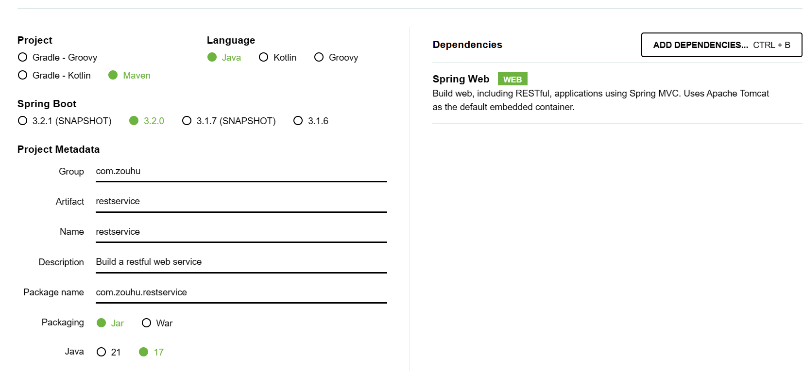

> 本文档构建一个简单的restful webservice， 在官网原文[Getting Started | Building a RESTful Web Service (spring.io)](https://spring.io/guides/gs/rest-service/#initial)的基础上进行操作

[TOC]


# 一、项目创建流程

本文的目标是构建一个服务，该服务将在http://localhost:8080/greeting接受HTTP GET请求

它将使用`greeting`的JSON表示进行响应，如下所示：

```
{"id":1,"content":"Hello, World!"}
```


## 1.1 创建项目

在官网上[Spring Initializr](https://start.spring.io/)创建项目




## 1.2 创建资源表示类

对`greeting`表示进行建模，创建一个资源表示类。

具体操作：为id和content提供一个Java record类，在`/src/main/java/com/zouhu/restservice/Greeting.java`添加如下代码

```
package com.zouhu.restservice;

public record Greeting(long id, String content) {
}
```

>  此应用程序使用`Jackson JSON`库自动将`greeting`类型的实例列表到JSON中。


## 1.3 创建资源控制类

在Spring构建RESTful Web服务的方法中，HTTP请求由控制器处理。

这些组件由@RestController注释标识，下面代码中所示的GreetingController（来自`src/main/java/com/example/restservice/GreetingController.java`）通过返回一个`greeting`类的新实例来处理 `/greeting`的GET请求：

```
package com.zouhu.restservice;

import org.springframework.web.bind.annotation.GetMapping;
import org.springframework.web.bind.annotation.RequestParam;
import org.springframework.web.bind.annotation.RestController;

import java.util.concurrent.atomic.AtomicLong;

@RestController
public class GreetingController {
    private static final String template = "Hello, %s!";
    private final AtomicLong counter = new AtomicLong();

    @GetMapping("/greeting")
    public Greeting greeting(@RequestParam(value = "name", defaultValue = "World") String name) {
        return new Greeting(counter.incrementAndGet(), String.format(template, name));
    }
}
```

传统的MVC控制器和前面显示的RESTful Web服务控制器之间的一个关键区别是**创建HTTP响应主体的方式**。这个RESTful Web服务控制器不依赖视图技术将`Greeting`数据执行到HTML，而是填充并返回一个`Greeting`对象。对象数据将作为JSON直接写入HTTP响应。


# 二、项目运行

运行RestserviceApplication类，启动项目

访问http://localhost:8080/greeting， 结果如下：

```
{
    "id": 1,
    "content": "Hello, World!"
}
```

访问http://localhost:8080/greeting?name=zouhu， 结果如下：

```
{
    "id": 2,
    "content": "Hello, zouhu!"
}
```

注意id属性是如何从1更改为2的。这证明您正在跨多个请求处理同一个GreetingController实例，并且它的计数器字段在每次调用时都按预期递增。


# 参考资料

[Getting Started | Building a RESTful Web Service (spring.io)](https://spring.io/guides/gs/rest-service/#initial)