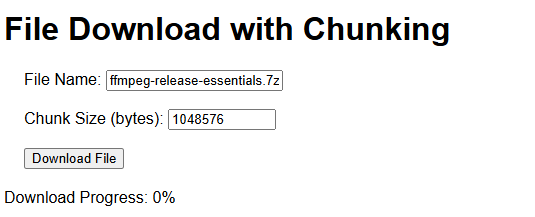

[TOC]

> 完整案例代码：[java-demos/spring-boot-file at main · idealzouhu/java-demos (github.com)](https://github.com/idealzouhu/java-demos/tree/main/spring-boot-file)

## 一、原理分析

断点上传和下载通常需要支持文件分片。

- **断点上传**：上传大文件时，支持从上一次中断的位置继续上传。
- **断点下载**：下载大文件时，支持从上一次中断的位置继续下载。


### 1.1 文件分片

文件分片的核心思想是将服务器上的大文件拆分成若干个小文件，等这些小份文件都下载好了之后，最后将小文件合并成一个完整的大文件。

以文件分片上传为例，**客户端责任为：**

- **分片：** 将文件切割成小片。

- **记录上传进度：** 记录哪些分片已上传、哪些还未上传。

- **上传分片：** 通过 HTTP 请求将每个分片上传到服务端。

**服务端责任为：**

- **接收分片：** 将每个分片临时存储。
- **记录已接收分片：** 记录分片的索引、大小等信息，以防止重复上传。
- **文件合并：** 在所有分片上传完成后，将它们合并成完整的文件。


### 1.2 断点续传和断点下载

断点续传依赖于客户端和服务端的**进度记录**。

- **客户端**：在上传分片时记录当前上传到第几块，下一次可以从该分片继续上传。
- **服务端**：通过每个分片的编号记录已接收的分片，检查是否还需要接收未完成的分片。


### 1.2 文件分片下载的 HTTP 参数

文件分片下载主要<font color="red">依赖于 HTTP 请求头的 `Range` 参数来实现</font>。 `Range` 参数用于HTTP请求中，允许客户端请求特定字节范围的内容，而不是整个资源。这通常用于下载大文件时，使得客户端可以实现分块下载、断点续传等功能。

例如，客户端只希望获取从200字节到400字节的内容。

```
GET /path/to/file.txt HTTP/1.1
Host: example.com
Range: bytes=200-400
```
服务器处理请求并返回一个206 Partial Content响应。
```
HTTP/1.1 206 Partial Content
Content-Range: bytes 200-400/1000
Content-Length: 201
Content-Type: text/plain

...（这里是文件的第200到400字节的内容）...
```


## 二、文件上传功能实现

在实现文件上传功能中， **客户端负责分片上传并记录上传进度**，**服务端负责接收和合并分片**。同时，本文使用分片编号来实现的，并没有使用 `range` 参数。

### 2.1 客户端(前端)

创建  `fragmentUpload.html`  文件，具体代码为：

```html
<!DOCTYPE html>
<html lang="en">
<head>
    <meta charset="UTF-8">
    <meta name="viewport" content="width=device-width, initial-scale=1.0">
    <title>File Chunk Upload</title>
</head>
<body>
<h2>File Chunk Upload with Resume</h2>
<input type="file" id="fileInput">
<button onclick="uploadFile()">Upload</button>
<div id="progress"></div>

<script>
    const CHUNK_SIZE = 5 * 1024 * 1024;  // 1MB
    let uploadedChunks = 0;

    async function uploadFile() {
        const fileInput = document.getElementById('fileInput');
        const file = fileInput.files[0];

        if (!file) {
            alert('Please select a file!');
            return;
        }

        let totalChunks = Math.ceil(file.size / CHUNK_SIZE);
        while (uploadedChunks < totalChunks) {
            let start = uploadedChunks * CHUNK_SIZE;
            let end = Math.min(start + CHUNK_SIZE, file.size);
            let chunk = file.slice(start, end);

            let formData = new FormData();
            formData.append('chunk', chunk);
            formData.append('fileName', file.name);
            formData.append('chunkNumber', uploadedChunks + 1);
            formData.append('totalChunks', totalChunks);

            try {
                await fetch('/upload-chunk', {
                    method: 'POST',
                    body: formData
                });

                uploadedChunks++;
                document.getElementById('progress').innerText = `Uploaded chunk ${uploadedChunks} of ${totalChunks}`;
            } catch (error) {
                alert('Upload failed. Retrying...');
                break;
            }
        }
    }
</script>
</body>
</html>
```

前端通过 `File.slice()` 方法实现文件分片，并逐个上传到服务器。如果上传过程中中断，记录上传进度，并在恢复时从中断处继续上传。


### 2.2 服务端

服务端接收分片，保存到指定目录，并在所有分片上传完成后合并它们。其中，每个上传的分片通过 `chunkNumber` 参数被保存到指定的临时目录中。

```java
@RequiredArgsConstructor
@RestController
public class FileChunkUploadController {
    // 文件临时目录，用于保存上传的分片文件
    private static final String TEMP_DIR = "D:\\Learning\\temp\\";

    // 文件上传目录，用于保存合并后的文件
    private static final String UPLOAD_DIR = "D:\\Learning\\upload\\";


    /**
     * 处理单个分片上传请求
     * <p>
     *     当文件较大或网络条件不稳定时，客户端可以将文件分割成多个分片分别上传
     *     这个方法负责接收单个分片，并将其保存到临时目录当所有分片上传完成后，将它们合并成一个完整的文件
     * </p>
     *
     * @param chunk 分片文件，包含文件的一部分
     * @param fileName 原始文件名，用于合并分片时命名
     * @param chunkNumber 当前分片的编号，从1开始
     * @param totalChunks 总分片数，用于判断是否所有分片都已上传
     * @return 分片上传的状态信息
     * @throws IOException 如果文件操作失败
     */
    @PostMapping("/upload-chunk")
    public ResponseEntity<String> uploadChunk(@RequestParam("chunk") MultipartFile chunk,
                                              @RequestParam("fileName") String fileName,
                                              @RequestParam("chunkNumber") int chunkNumber,
                                              @RequestParam("totalChunks") int totalChunks) throws IOException {

        // 保存分片到临时目录
        File tempFile = new File(TEMP_DIR + fileName + "_" + chunkNumber);
        chunk.transferTo(tempFile);

        // 检查是否所有分片都已上传
        if (isAllChunksUploaded(fileName, totalChunks)) {
            mergeChunks(fileName, totalChunks);
        }

        return ResponseEntity.ok("Chunk " + chunkNumber + " uploaded");
    }

    // 判断是否所有分片都上传完毕
    private boolean isAllChunksUploaded(String fileName, int totalChunks) {
        for (int i = 1; i <= totalChunks; i++) {
            File file = new File(TEMP_DIR + fileName + "_" + i);
            if (!file.exists()) {
                return false;
            }
        }
        return true;
    }

    // 合并所有分片
    private void mergeChunks(String fileName, int totalChunks) throws IOException {
        File mergedFile = new File(UPLOAD_DIR + fileName);
        try (FileOutputStream fos = new FileOutputStream(mergedFile, true)) {
            for (int i = 1; i <= totalChunks; i++) {
                File chunkFile = new File(TEMP_DIR + fileName + "_" + i);
                try (FileInputStream fis = new FileInputStream(chunkFile)) {
                    byte[] buffer = new byte[1024];
                    int bytesRead;
                    while ((bytesRead = fis.read(buffer)) != -1) {
                        fos.write(buffer, 0, bytesRead);
                    }
                }
                chunkFile.delete(); // 删除分片
            }
        }
    }
}

```


## 三、文件下载功能实现

在实现文件下载功能中，

- **客户端**负责接收分片，记录上传进度，以及最后的合并分片。
- **服务端**负责下载分片。


### 3.1 客户端(前端)

客户端实现逻辑为：

1. **存储所有分片**：使用 `blobParts` 数组来存储每个下载的分片的 `Blob` 对象。

2. **整合分片**：在所有分片下载完成后，使用 `new Blob(blobParts)` 创建一个完整的 `Blob`，然后生成一个 URL 并触发下载。

3. **触发下载**：在所有分片下载并整合完后，创建一个下载链接并点击它以触发下载。

创建  `fragmentDownload.html`  文件，具体代码为：

```html
<!DOCTYPE html>
<html lang="en">
<head>
    <meta charset="UTF-8">
    <meta name="viewport" content="width=device-width, initial-scale=1.0">
    <title>File Download with Chunking</title>
    <style>
        body {
            font-family: Arial, sans-serif;
        }
        #downloadForm {
            margin: 20px;
        }
        #chunkSize {
            width: 100px;
        }
        #progress {
            margin-top: 20px;
        }
    </style>
</head>
<body>
<h1>File Download with Chunking</h1>
<div id="downloadForm">
    <label for="fileName">File Name:</label>
    <input type="text" id="fileName" placeholder="example.txt" required>
    <br><br>
    <label for="chunkSize">Chunk Size (bytes):</label>
    <input type="number" id="chunkSize" value="1048576" required> <!-- 1 MB -->
    <br><br>
    <button id="downloadButton">Download File</button>
</div>
<div id="progress">
    <p>Download Progress: <span id="progressText">0</span>%</p>
</div>

<script>
    async function getFileLength(fileName) {
        const response = await fetch(`download-chunk?fileName=${fileName}`, { method: 'HEAD' });
        const contentLength = response.headers.get('content-length');
        return parseInt(contentLength, 10);
    }

    async function downloadFile(fileName, start, end) {
        const range = `bytes=${start}-${end}`;
        const response = await fetch(`download-chunk?fileName=${fileName}`, {
            method: 'GET',
            headers: {
                'Range': range,
            }
        });

        if (response.status === 206) {
            return await response.blob(); // 返回 Blob 数据
        } else {
            throw new Error(`Error: ${response.status}`);
        }
    }

    async function downloadFileInChunks(fileName, chunkSize) {
        const fileLength = await getFileLength(fileName);
        let start = 0;
        let end = Math.min(chunkSize - 1, fileLength - 1);
        const totalChunks = Math.ceil(fileLength / chunkSize);
        let downloadedChunks = 0;

        const blobParts = []; // 存储所有分片的 Blob

        while (start < fileLength) {
            try {
                const blob = await downloadFile(fileName, start, end);
                blobParts.push(blob); // 将分片加入数组

                downloadedChunks++;
                const progressPercentage = Math.round((downloadedChunks / totalChunks) * 100);
                document.getElementById('progressText').innerText = progressPercentage;

                start += chunkSize;
                end = Math.min(start + chunkSize - 1, fileLength - 1);
            } catch (error) {
                console.error(`Failed to download chunk: ${error}`);
                break;
            }
        }

        // 所有分片下载完成后，整合成一个 Blob
        const finalBlob = new Blob(blobParts);
        const url = URL.createObjectURL(finalBlob);
        const a = document.createElement('a');
        a.href = url;
        a.download = fileName; // 设置下载文件名
        document.body.appendChild(a);
        a.click();
        document.body.removeChild(a);
        URL.revokeObjectURL(url); // 释放内存

        if (start >= fileLength) {
            alert('Download completed!');
        }
    }

    document.getElementById("downloadButton").onclick = function() {
        const fileName = document.getElementById("fileName").value;
        const chunkSize = parseInt(document.getElementById("chunkSize").value);
        downloadFileInChunks(fileName, chunkSize).catch(console.error);
    };
</script>
</body>
</html>
```

在上述代码中，

- `downloadFileInChunks` 函数：控制文件下载的分片逻辑，循环调用 `downloadFile` 函数进行分片下载。
- `downloadFile` 函数：执行实际的文件下载请求。其中，HTTP 请求设置为 `xhr.open("GET", download-chunk?fileName=${fileName}, true);`


### 3.2 服务端

服务端主要实现根据 `range` 参数返回对应的文件分片即可。

```java
@RestController
public class FileChunkDownloadController {
    private static final String FILE_DIRECTORY = "D:\\Program Files\\";

    // 处理文件下载请求的方法
    @GetMapping("/download-chunk")
    public ResponseEntity<StreamingResponseBody> downloadFile(
            @RequestParam String fileName,
            @RequestHeader(value = HttpHeaders.RANGE, required = false) String range) throws IOException {

        // 根据文件名构建文件对象
        File file = new File(FILE_DIRECTORY, fileName);
        if (!file.exists()) {
            return ResponseEntity.status(HttpStatus.NOT_FOUND).build();
        }

        // 获取文件长度, 初始化下载的起始和结束位置
        long fileLength = file.length();
        long start = 0;
        long end = fileLength - 1;

        // 处理 Range 请求
        if (range != null) {
            // 解析 Range 请求中的起始和结束位置
            String[] ranges = range.replace("bytes=", "").split("-");
            start = Long.parseLong(ranges[0]);
            if (ranges.length > 1 && !ranges[1].isEmpty()) {
                end = Long.parseLong(ranges[1]);
            }
        }

        // 确保请求的范围合法
        if (start > end || start >= fileLength) {
            // 如果请求范围不合法，返回 416 REQUESTED RANGE NOT SATISFIABLE
            return ResponseEntity.status(HttpStatus.REQUESTED_RANGE_NOT_SATISFIABLE)
                    .header(HttpHeaders.CONTENT_RANGE, "bytes */" + fileLength)
                    .build();
        }

        // 如果结束位置超出文件长度，调整结束位置
        if (end >= fileLength) {
            end = fileLength - 1;
        }

        // 设置内容长度
        long contentLength = end - start + 1;

        // 使用 final 关键字定义的变量
        final long finalStart = start;
        final long finalEnd = end;
        final long finalContentLength = contentLength;

        // 创建 StreamingResponseBody 对象
        StreamingResponseBody responseBody = outputStream -> {
            try (InputStream inputStream = new FileInputStream(file)) {
                inputStream.skip(finalStart); // 跳过起始位置

                byte[] buffer = new byte[1024];
                int bytesRead;
                long bytesToRead = finalContentLength;

                while (bytesToRead > 0 && (bytesRead = inputStream.read(buffer, 0, (int) Math.min(buffer.length, bytesToRead))) != -1) {
                    outputStream.write(buffer, 0, bytesRead);
                    bytesToRead -= bytesRead;
                }
            } catch (IOException e) {
                // 打印异常信息
                e.printStackTrace();
            }
        };

        return ResponseEntity.status(HttpStatus.PARTIAL_CONTENT)
                .header(HttpHeaders.CONTENT_TYPE, MediaType.APPLICATION_OCTET_STREAM_VALUE)
                .header(HttpHeaders.CONTENT_DISPOSITION, "attachment; filename=\"" + fileName + "\"")
                .header(HttpHeaders.CONTENT_RANGE, "bytes " + finalStart + "-" + finalEnd + "/" + fileLength)
                .header(HttpHeaders.ACCEPT_RANGES, "bytes")
                .header(HttpHeaders.CONTENT_LENGTH, String.valueOf(finalContentLength))
                .body(responseBody);
    }
}
```


## 四、功能测试

### 4.1 文件上传功能测试

打开客户端 http://localhost:8080/fragmentUpload.html， 上传文件。


在测试断点续传的过程中，重启服务端，然后再次点击客户端前端界面的 `Upload` 按钮。


### 4.2 文件下载功能实现

打开客户端 http://localhost:8080/fragmentDownload.html， 上传文件 。

> 不能直接使用 [http://localhost:8080/download-chunk?fileName=demo.txt](http://localhost:8080/download-chunk?fileName=学位论文模板 (1).docx) 来访问，会出现问题。




## 参考资料

[实现大文件的断点下载、分片下载 (qq.com)](https://mp.weixin.qq.com/s/2qB6vESIUw7YPk4rL16Lzw)