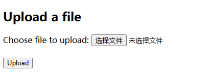
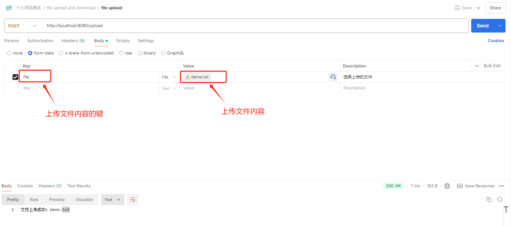
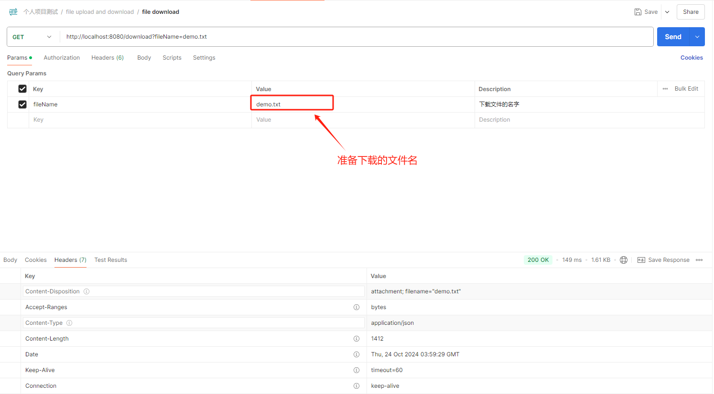

[TOC]

> 完整案例代码：[java-demos/spring-boot-file at main · idealzouhu/java-demos (github.com)](https://github.com/idealzouhu/java-demos/tree/main/spring-boot-file)

## 一、原理分析

### 1.1 请求类型

文件上传通常使用 `multipart/form-data` 类型的 POST 请求。

- **`multipart/form-data`**：用于在表单提交时上传文件的 MIME 类型。它允许将文件和其他表单字段组合在一起发送，服务器能识别出每个部分并提取出文件。

文件下载则只是简单的 GET 请求。在 Spring MVC 中，返回对象通常是 `ResponseEntity` 或者 `HttpServletResponse` 对象。


### 1.2 服务器解析

现有的 Web 框架都内置了处理文件上传的功能。在 Spring MVC 中， `MultipartFile` 是用来表示上传的文件，服务器会自动解析该文件并进行处理。

`MultipartFile` 的常用方法有：

- getName()：获取文件在服务器上的文件名，可能已经被服务器修改。
- getOriginalFilename()：获取文件在客户端上的原始文件名，没有被服务器修改。
- getContentType()：获取文件的内容类型。
- isEmpty()：判断文件是否为空。
- getSize()：获取文件大小（字节）。
- getBytes()：读取文件内容为字节数组。
- getInputStream()：获取文件内容的输入流。
- getResource()：将文件转换为资源对象。
- transferTo(File dest)：将文件内容传输到指定的目标文件。
- transferTo(Path dest)：将文件内容传输到指定的目标路径


## 二、功能实现

### 2.1 创建项目并导入依赖

在  [start.springboot.io](https://start.springboot.io/) 创建项目，导入以下依赖。

```xml
<dependency>
    <groupId>org.springframework.boot</groupId>
    <artifactId>spring-boot-starter-web</artifactId>
</dependency>
```

### 2.2 文件上传功能实现

将文件上传的具体逻辑抽象到一个 `FileService` 中，让 `Controller` 调用该服务处理上传请求。

#### 2.2.1 文件上传 Service

```java
@Service
public class FileService {

    /**
     * 上传文件
     *
     * @param file
     * @return
     */
    public String uploadFile(MultipartFile file) {
        // 检查文件是否为空
        if (file.isEmpty()) {
            return "上传失败，因为文件是空的。";
        }

        // 获取文件名和保存路径
        String fileName = file.getOriginalFilename();
        String filePath = "C:/uploads/"; // 自定义文件保存路径
        File dest = new File(filePath + fileName);

        // 确保目录存在
        if (!dest.getParentFile().exists()) {
            dest.getParentFile().mkdirs();
        }

        // 保存文件
        try {
            file.transferTo(dest);
            return "文件上传成功：" + fileName;
        } catch (IOException e) {
            e.printStackTrace();
            return "文件上传失败。";
        }
    }
}
```


#### 2.2.2 文件上传 Controller

```java
@RequiredArgsConstructor
@RestController
public class FileUploadController {

    private final FileService fileService;

    /**
     * 上传文件自动绑定到 MultipartFile 对象中
     *
     * @param file 上传文件
     * @return
     */
    @PostMapping("/upload")
    public String upload(@RequestParam("file") MultipartFile file) {
        return fileService.uploadFile(file);
    }
}
```


### 2.3 文件下载功能实现

将文件上传的具体逻辑抽象到一个 `FileService` 中，让 `Controller` 调用该服务处理上传请求。

#### 2.3.1 文件下载 Service

```java
@Service
public class FileService {
    /**
     * 下载文件
     *
     * 根据文件名构建文件路径，并检查文件是否存在如果文件不存在，则返回404未找到的响应
     * 如果文件存在，将文件作为资源包装，并设置HTTP响应头以提示浏览器下载文件
     *
     * @param fileName 要下载的文件名
     * @return 包含文件资源的响应实体，如果文件不存在则为404响应
     */
    public ResponseEntity<Resource> downloadFile(String fileName) {
        // 构建文件路径
        String filePath = "C:/uploads/" + fileName;
        File file = new File(filePath);

        // 检查文件是否存在
        if (!file.exists()) {
            // 文件不存在，返回404未找到
            return ResponseEntity.notFound().build();
        }

        // 将文件包装为资源
        Resource resource = new FileSystemResource(file);
        // 创建HTTP响应头，用于指定文件下载
        HttpHeaders headers = new HttpHeaders();
        headers.add(HttpHeaders.CONTENT_DISPOSITION, "attachment; filename=\"" + fileName + "\"");

        // 返回包含文件资源和响应头的响应实体
        return ResponseEntity.ok()
                .headers(headers)
                .body(resource);
    }
}
```


#### 2.3.2 文件下载 Controller

```java
@RequiredArgsConstructor
@RestController
public class FileDownloadController {

    private final FileService fileService;

    @GetMapping("/download")
    public ResponseEntity<Resource> downloadFile(@RequestParam String fileName) {
        return fileService.downloadFile(fileName);
    }
}
```


### 2.4 文件上传前端代码(可选)

该部分代码为 [2.2 文件上传功能实现](###2.2 文件上传功能实现) 的前端实现。

#### 2.4.1 上传文件的 HTML 表单

创建 `upload.html` 文件，放在 `src/main/resources/static` 目录下。

```html
<!DOCTYPE html>
<html>
<head>
    <title>File Upload</title>
</head>
<body>

<h2>Upload a file</h2>

<form id="uploadForm">
    <label for="file">Choose file to upload:</label>
    <input type="file" id="file" name="file" required />
    <br><br>
    <button type="submit">Upload</button>
</form>

<script>
    document.getElementById('uploadForm').addEventListener('submit', function(event) {
        event.preventDefault();  // 防止表单的默认提交行为

        const fileInput = document.getElementById('file');
        const formData = new FormData();
        formData.append('file', fileInput.files[0]);

        // 使用 Fetch API 发送文件到后端
        fetch('/upload', {
            method: 'POST',
            body: formData
        })
        .then(response => response.text())
        .then(data => alert('File uploaded successfully: ' + data))
        .catch(error => console.error('Error uploading file:', error));
    });
</script>

</body>
</html>
```

其中，**表单中 `name="file"`** 指定了文件在请求体中的键，后端服务器将通过这个名称来获取文件数据。


#### 2.4.2 访问前端页面

进入前端页面的 URL 为 http://localhost:8080/upload.html




## 三、功能测试

### 3.1 测试文件上传

使用 Postman 发送 `POST` 请求到 `/upload`，并选择一个文件进行上传。示例 URL 为

`http://localhost:8080/upload`




### 3.2 测试文件下载

使用 Postman 或 HTML 表单发送 `POST` 请求，下载指定的文件。

示例 URL 为 `http://localhost:8080/download?fileName=demo.txt`




## 参考资料

[Java实战：Spring Boot 实现文件上传下载功能_springboot 文件下载-CSDN博客](https://blog.csdn.net/oandy0/article/details/136355704)

[Spring Boot文件上传与下载讲解与实战（超详细 附源码）-阿里云开发者社区 (aliyun.com)](https://developer.aliyun.com/article/1398679)