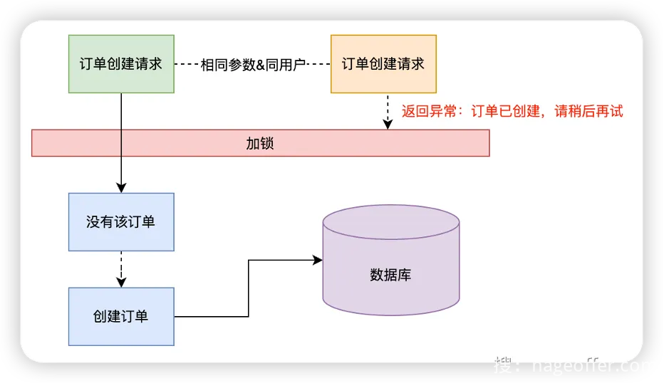
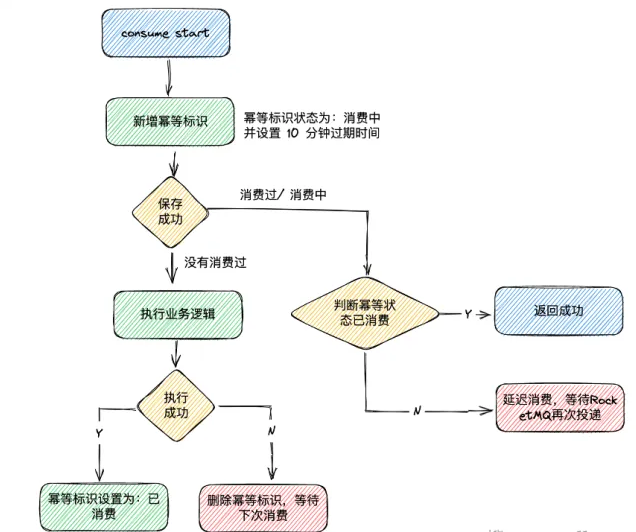

## 一、幂等问题概述

幂等性是数学和计算机科学中的概念，用于描述操作无论执行多少次，都产生相同结果的特性。

在系统中，幂等问题主要包括：

- 接口幂等： 即防重复提交
- 消息队列幂等

## 二、接口幂等解决方案

从分布式锁、Token 令牌以及去重表实现上来说，有个对应关系：

- 分布式锁：PARAM 和 SPEL。
- Token 令牌：TOKEN。
- 去重表：SPEL。

### 2.1 分布式锁

当用户提交请求时，服务器端可以生成一个唯一的标识，例如使用 UUID。

在处理用户请求之前，服务器尝试获取一个分布式锁。如果成功获取到分布式锁，那么则执行接下来的正常业务逻辑流程。因为锁已经被获取，这样可以确保其他请求无法使用相同的标识，避免重复处理。在请求处理完成后，服务器需要释放分布式锁。

分布式关键的一个概念就是分布式锁 Key，由以下几部分组成：

- 分布式锁前缀。
- 请求路径。
- 当前访问用户。
- 参数 MD5。

### 2.2 token 令牌

token 令牌和 分布式锁基本上是差不多的思想。

### 2.3 去重表

去重表是指在使用 Redis 或者 MySQL 作为存储时，为了实现幂等性而用于**记录已经处理过的请求或操作**，以防止重复执行。

具体来说，当客户端发送请求时，服务端会先查询 Redis 去重表来检查该请求是否已经被处理过。如果在存在对应的记录，表示请求已经执行过，服务端可以直接返回之，而不再执行重复操作。如果在不存在对应的记录，表示请求是新的，服务端会执行相应的业务逻辑，并在处理完成后将请求的唯一标识（如请求 ID 或标识）添加到 Redis 去重表中，以便后续的重复请求可以被正确识别和处理。

另外，如果消息已经在消费中，抛出异常，消息会触发延迟消费，在消息队列消费失败的场景下即发送到重试队列 `RETRY TOPIC`。

# 三、消息队列幂等解决方案

## 3.1 去重表

# 参考资料

[手摸手实现接口幂等组件库 (yuque.com)](https://www.yuque.com/magestack/12306/xoea6i2yluci1w0q)