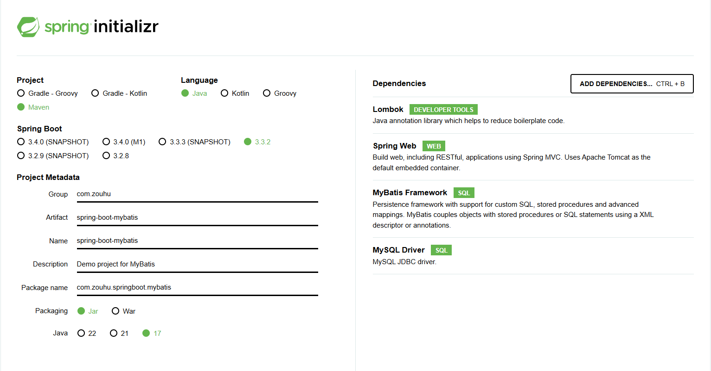

[TOC]

> 本文源代码地址为 [java-demos/spring-boot-mybatis-starter](https://github.com/idealzouhu/java-demos/tree/main/spring-boot-mybatis-starter)

## 一、项目创建

### 1.1 创建 Idea 项目

通过 [start.springboot.io](https://start.springboot.io/) 创建工程。选择 `MySQL Driver`、`Spring Web` 、`MyBatis Framework`,  `Lombock`基本依赖，点击 “GENERATE” 下载到本地后，导入到IDEA中。




### 1.2 导入必要依赖

mybatis 的依赖主要有以下两种:

- **mybatis**: 核心框架，适用于任何 Java 应用。

- **mybatis-spring-boot-starter**: 针对 Spring Boot 的简化封装，提供开箱即用的体验。自动配置了 MyBatis 的基本组件，如 SqlSessionFactory 和 MapperScannerConfigurer。

本文选择 **mybatis** 依赖，具体版本查看 [Maven Repository: org.mybatis (mvnrepository.com) ](https://mvnrepository.com/artifact/org.mybatis)

```xml
<dependency>
    <groupId>org.mybatis.spring.boot</groupId>
    <artifactId>mybatis-spring-boot-starter</artifactId>
    <version>3.0.3</version>
</dependency>

<dependency>
    <groupId>com.mysql</groupId>
    <artifactId>mysql-connector-j</artifactId>
    <scope>runtime</scope>
</dependency>
```


## 二、数据库配置

### 2.1 创建数据库

创建数据库 `reggie` ， 运行项目的 `src/main/resources/sql/db_reggie.sql` ，导入表结构和数据。

> 数据库的来源为 [黑马程序员Java项目实战《瑞吉外卖》bilibili](https://www.bilibili.com/video/BV13a411q753/?spm_id_from=333.337.search-card.all.click&vd_source=52cd9a9deff2e511c87ff028e3bb01d2)

```shell
# 创建数据库
$ CREATE DATABASE `reggie` CHARACTER SET 'utf8mb4' COLLATE 'utf8mb4_general_ci';

# 运行sql文件，导入表结构和数据
$ use reggie
$ source D:/spring-boot-redis/src/main/resources/sql/db_reggie.sql
```

在数据库中，不同表的具体含义如下：

| 序号 | 表名          | 说明             |
| ---- | ------------- | ---------------- |
| 1    | employee      | 员工表           |
| 2    | category      | 菜品和套餐分类表 |
| 3    | dish          | 菜品表           |
| 4    | setmeal       | 套餐表           |
| 5    | setmeal_dish  | 套餐菜品关系表   |
| 6    | dish_flaver   | 菜品口味关系表   |
| 7    | user          | 用户表(C端）     |
| 8    | address_book  | 地址薄表         |
| 9    | shopping_cart | 购物车表         |
| 10   | orders        | 订单表           |
| 11   | order_detail  | 订单明细表       |


### 2.2 配置数据库连接信息

数据库的连接配置内容在  `application.yaml` 里面设置。

设置内容如下：

```yaml
spring:
  datasource:
    url: jdbc:mysql://localhost:3306/reggie?useSSL=false&amp;serverTimezone=UTC
    username: root
    password: root
    driver-class-name: com.mysql.cj.jdbc.Driver
```


## 三、项目测试和运行

在配置数据库和 MyBatis 后，项目步骤为：

1. **创建实体类**：定义与数据库表结构相对应的 Java 类，通常包括属性、构造方法、getter 和 setter 方法。
2. **创建映射文件**：使用 XML 文件定义数据库操作语句（如查询、插入、更新和删除），并设置结果映射到 Java 对象的规则。
3. **创建映射接口**：为每个映射文件创建对应的 Java 接口，定义与映射文件中相同的操作方法。
4. **配置映射关系**：在 `application.yaml` 文件中，将映射文件和映射接口关联，指定它们的路径和命名空间。
5. **调用Mapper接口进行查询**：使用 `SqlSessionFactory` 创建一个 `SqlSession` 实例，然后利用获得的 Mapper 接口实例调用方法执行数据库操作。


### 3.1 创建实体类

新建文件 `com/zouhu/springboot/mybatis/entity/User.java`， 内容如下：

```java
import lombok.Data;
import java.io.Serializable;

/**
 * 用户信息
 */
@Data
public class User implements Serializable {

    private static final long serialVersionUID = 1L;

    private Long id;

    //姓名
    private String name;


    //手机号
    private String phone;


    //性别 0 女 1 男
    private String sex;


    //身份证号
    private String idNumber;


    //头像
    private String avatar;


    //状态 0:禁用，1:正常
    private Integer status;
}
```


### 3.2 创建 mybatis.xml 文件

为了数据库持久层的实现，需要添加对应的MyBatis框架的XML映射文件，MyBatis的XML映射文件固定格式如下：

```xml
<?xml version="1.0" encoding="UTF-8"?>
<!DOCTYPE mapper PUBLIC "-//mybatis.org//DTD Mapper 3.0//EN" "http://mybatis.org/dtd/mybatis-3-mapper.dtd">
<mapper namespace="">

</mapper>
```

现在，我们可以创建 User 类对应的文件 `com/zouhu/springboot/mybatis/starter/mapper/UserMapper.java`，实现查询所有用户的方法  `selectAll`。具体代码如下：

```xml
<?xml version="1.0" encoding="UTF-8"?>
<!DOCTYPE mapper PUBLIC "-//mybatis.org//DTD Mapper 3.0//EN" "http://mybatis.org/dtd/mybatis-3-mapper.dtd">
<mapper namespace="com.zouhu.springboot.mybatis.mapper.UserMapper">
    <select id="selectAll" resultType="com.zouhu.springboot.mybatis.entity.User">
        select * from user
    </select>
</mapper>
```


### 3.3 创建 mapper 接口

新建 `com/zouhu/springboot/mybatis/mapper/UserMapper.java` ， 具体内容如下：

```java
import com.zouhu.springboot.mybatis.entity.User;
import org.apache.ibatis.annotations.Mapper;

import java.util.List;

@Mapper
public interface UserMapper {
    List<User> selectAll();
}
```

其中， `selectAll` 方法名对应`com/zouhu/springboot/mybatis/starter/mapper/UserMapper.java` 文件中mapper 的 id 属性。


### 3.4 配置映射关系

在 `application.yaml` 中， 将映射文件和映射接口关联，指定它们的路径和命名空间。

```yaml
mybatis:
  # 配置mapper.xml文件位置
  mapper-locations: classpath:mapper/UserMapper.xml
```


### 3.5 测试  mapper 接口

创建测试方法，具体内容如下：

```java
@SpringBootTest
class UserMapperTest {

    @Autowired
    private UserMapper userMapper;

    @Test
    void selectAll() {
        List<User> users = userMapper.selectAll();
        for (User user : users) {
            System.out.println(user);
        }
    }
}
```

测试结果为：

```shell
User(id=1, name=张三, phone=13800138000, sex=男, idNumber=null, avatar=null, status=1)
User(id=2, name=李四, phone=13900139000, sex=女, idNumber=null, avatar=null, status=1)
User(id=3, name=王五, phone=13700137000, sex=男, idNumber=null, avatar=null, status=0)
User(id=4, name=赵六, phone=13600136000, sex=女, idNumber=null, avatar=null, status=1)
User(id=5, name=钱七, phone=13500135000, sex=男, idNumber=null, avatar=null, status=0)
```


## 参考资料

[Mybatis基本使用教程（小白向）_使用mybatis操作数据库有哪些具体步骤?-CSDN博客](https://blog.csdn.net/qq_40719095/article/details/106888530)

[Spring Boot 整合 MyBatis - spring 中文网 (springdoc.cn)](https://springdoc.cn/spring-boot-mybatis/#:~:text=Spring Boot 整合 MyBatis 1 创建 Spring Boot,总结 在 Spring Boot 中整合 MyBabtis 只需要遵循如下几个关键的步骤。 )

[【框架篇】MyBatis starter 介绍及使用（详细教程）_mybatis是干嘛用的怎么用-CSDN博客](https://blog.csdn.net/m0_64338546/article/details/132153390)

